## **Resource：** 
Download code ,CoolTerm software ,Driver and more details, please refer to the following link:
[https://fs.keyestudio.com/KS4022-4023](https://fs.keyestudio.com/KS4022-4023)

# KS4022/KS4023 EASY Plug Ultimate Starter Kit for BBC Micro:bit STEM EDU

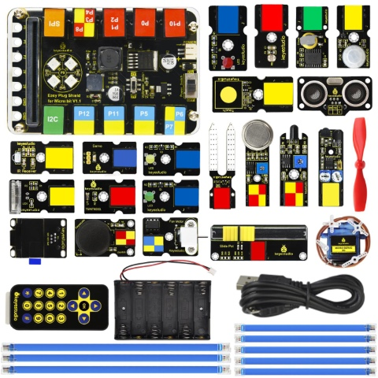

## 1. Description

Micro:bit is significantly applied to STEM education for teenagers, as a small microcontroller, which features small in size, easy to carry, and powerful function. At present, innovative technology products, like robots, wearable devices and interactive electronic games can be produced by programming and code.

[MakeCode](https://makecode.com/) is a framework for creating interactive and engaging programming experiences for those new to the world of programming. The platform provides the foundation for a tailored coding experience to create and run user programs on actual hardware or in a simulated target.

To make you deeply know the micro:bit, we also provide test code and projects.

This ultimate starter kit incorporates different sensors and modules such as passive buzzer, 1602 LCD module, RGB, flame sensor and so on. The detailed projects, from simple to difficult will spur your inspiration and bring in the magical programming world.

## 2. Kit List

|  #   |                        **Component**                         | **QTY** |                   **Picture**                    |
| :--: | :----------------------------------------------------------: | ------- | :----------------------------------------------: |
|  0   | Micro:bit main board **is not included** in KS4022 Kit  Micro:bit main board is **included** in KS4023 Kit | 1       |   |
|  1   |             EASY Plug Shield for micro bit V1.1              | 1       |   |
|  2   |                  EASY Plug Green LED Module                  | 1       | 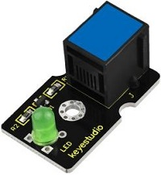 |
|  3   |                 EASY Plug Yellow LED Module                  | 1       |  |
|  4   |                   EASY Plug Red LED Module                   | 1       |  |
|  5   |                   EASY Plug Photoresistor                    | 1       | 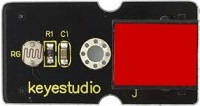 |
|  6   |                EASY Plug Soil Humidity Sensor                | 1       |  |
|  7   |                 EASY Plug Analog Gas Sensor                  | 1       | 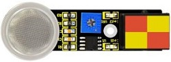 |
|  8   |           EASY Plug TEMT6000  Ambient Light Sensor           | 1       |  |
|  9   |            EASY Plug Slide  Potentiometer Module             | 1       | 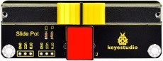 |
|  10  |              EASY Plug Capacitive  Touch Module              | 1       | 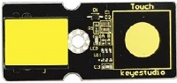 |
|  11  |                    EASY Plug Knock Sensor                    | 1       | 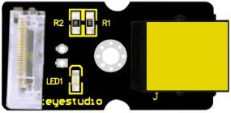 |
|  12  |                    EASY Plug Flame Sensor                    | 1       |  |
|  13  |                 EASY Plug PIR Motion Sensor                  | 1       |  |
|  14  |                    EASY Plug IR Receiver                     | 1       |  |
|  15  |                 Keyestudio IR Remote Control                 | 1       |   |
|  16  |                    EASY Plug Servo Module                    | 1       | 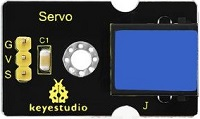 |
|  17  |                   Keyestudio 9G Servo 90°                    | 1       |   |
|  18  |           EASY Plug IR Obstacle  Avoidance Sensor            | 1       | 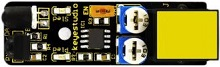 |
|  19  |                EASY Plug DS3231 Clock Module                 | 1       | 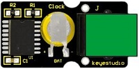 |
|  20  |                  EASY Plug Joystick Module                   | 1       | 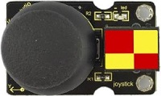 |
|  21  |               EASY Plug SR01 Ultrasonic Sensor               | 1       | 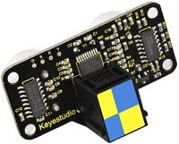 |
|  22  |                    EASY Plug OLED Module                     | 1       |  |
|  23  |                  EASY Plug L9110 Fan Module                  | 1       |  |
|  24  |                    200mm Blue RJ11 Cable                     | 5       |  |
|  25  |                    300mm Blue RJ11 Cable                     | 3       |   |
|  26  |                       Micro USB Cable                        | 1       |  |
|  27  |                   6-Slot AA Battery Holder                   | 1       | 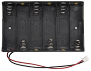  |
|  28  |                1.5V AA Battery(Not Included)                 | 6       | 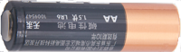  |

## 3. Introduction

### ( 1 ) What is Micro:bit?

Designed by BBC, Micro:bit main board aims to help children aged above 10 years old to have a better learning of programming.

It is equipped with loads of components,including a 5*5 LED dot matrix, 2 programmable buttons, a compass, a Micro USB interface and a Bluetooth module and others. Though it is just the size of a credit card, it boasts multiple functions. To name just a few, it can be applied in programming video games, making interactions between light and sound, controlling a robot, conducting scientific experiments, developing wearable devices and make some cool inventions like robots and musical instruments, basically everything imaginable.

The latest version, that’s version 2.0, of Micro:bit main board has a touch-sensitive logo and a MEMS microphone. And there is a buzzer built in the other side of the board which makes playing all kinds of sound possible without any external equipment. The golden fingers and gears added provide a better fixing of crocodile clips. Moreover, this board has a sleeping mode to lower the power consumption of battery and it can be entered if users long press the Reset & Power button on the back of it. More importantly, the CPU capacity of this version is much better than that of the V1.5 and the V2 has more RMA. 

In final analysis, the Micro:bit main board V2 can allow customers to explore more functions so as to make more innovative products.

### ( 2 ) Comparison between V2.0 & V1.5 

**Micro:bit main Board V2.0**

**Micro:bit main Board V1.5**

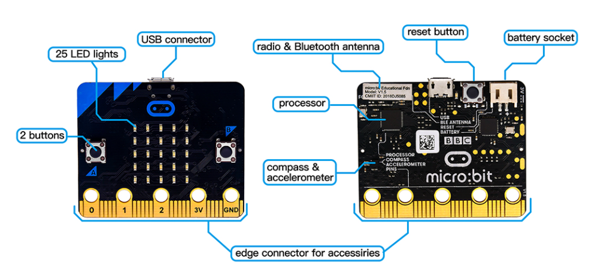

**More details:**

For the Micro: Bit main board V2, pressing the Reset & Power button , it will reset the Micro: Bit and rerun the program. If you hold it tight, the red LED will slowly get darker. When the power indicator becomes darker, releasing the button and your Micro: Bit board will enter sleep mode for power saving .This will make your battery more durable. And you could press this button again to ‘wake up’ your Micro:bit.

For more information,please resort to following links：

[https://tech.microbit.org/hardware/](https://tech.microbit.org/hardware/)
[https://microbit.org/new-microbit/](https://microbit.org/new-microbit/)
[https://www.microbit.org/get-started/user-guide/overview/](https://www.microbit.org/get-started/user-guide/overview/)
[https://microbit.org/get-started/user-guide/features-in-depth/](https://microbit.org/get-started/user-guide/features-in-depth/)

### ( 3 ) Pinout 

Micro:bit main board V2.0 VS V1.5

Browse the official website for more details:

[https://tech.microbit.org/hardware/edgeconnector/](https://tech.microbit.org/hardware/edgeconnector/)

[https://microbit.org/guide/hardware/pins/](https://microbit.org/guide/hardware/pins/)

### ( 4 ) Notes for the application of Micro:bit main board V2.0 

a. It is recommended to cover it with a silicone protector to prevent short circuit for it has a lot of sophisticated electronic components.

b. Its IO port is very weak in driving since it can merely handle current less than 300mA. Therefore, do not connect it with devices operating in large current,such as servo MG995 and DC motor or it will get burnt. Furthermore, you must figure out the current requirements of the devices before you use them and it is generally recommended to use the board together with a Micro:bit shield.

c. It is recommended to power the main board via the USB interface or via the battery of 3V. The IO port of this board is 3V, so it does not support sensors of 5V. If you need to connect sensors of 5 V, a Micro: Bit expansion board is required.

d.When using pins(P3, P4, P6, P7, P10)shared with the LED dot matrix, blocking them from the matrix or the LEDs may display randomly and the data about sensors maybe wrong.

e.The battery port of 3V cannot be connected with battery more than 3.3V or the main board will be damaged.

f. Forbid to use it on metal products to avoid short circuit.

To put it simple, Micro:bit V2 main board is like a micro computer which has made programming at our fingertips and enhanced digital innovation. And about programming environment, BBC provides a website: https://microbit.org/code/, which has a graphical MakeCode program easy for use.

## 4. Install Micro:bit Driver

If you have downloaded micro:bit driver, then no need to download it again.

If it is you first time to use micro:bit main board, then you will have to download the driver.

First of all, connect the micro:bit to your computer using a USB cable.

And enter the link [https://fs.keyestudio.com/KS4022-4023](https://fs.keyestudio.com/KS4022-4023) to download the driver file of micro:bit, 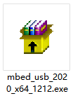.

## 5. Getting Started with Micro:bit

The following instructions are applied for Windows system but can also serve as a reference if you are using a different system.

### 5.1 Write code and program

This chapter describes how to write program with the App Micro: Bit and load the program to the Micro: Bit main board V2. You are recommended to browse the official website of Micro:bit for more details, and the link is attached below:

[https://microbit.org/guide/quick/](Https://microbit.org/guide/quick/)

#### Step 1: connect the Micro: Bit main board V2 with your computer

Firstly, link the Micro: Bit main board V2 with your computer via the USB cable. Macs, PCs,  Chromebooks and Linux （including Raspberry Pi）systems are all compatible with the Micro: Bit main board V2.

Note that if you are about to pair the board with your phone or tablet, please refer to this link:

[https://microbit.org/get-started/user-guide/mobile/](https://microbit.org/get-started/user-guide/mobile/)

Secondly, if the red LED on the back of the board is on, that means the board is powered. Then Micro: Bit main board V2 will appear on your computer as a driver named 'MICROBIT'. Please note that it is not an ordinary USB disk as shown below.

#### Step 2: writing programs

View the link [https://makecode.microbit.org/](https://makecode.microbit.org/) in your browser;

Click ; The dialog box  appears, fill it with ‘heartbeat’ and click  to edit.

(If you are running Windows 10 system, it is also viable to edit on the APP MakeCode for micro:bit , which is exactly like editing in the website. And the link to the APP is [https://www.microsoft.com/zh-cn/p/makecode-for-micro-bit/9pjc7sv48lcx?ocid=badgep&rtc=1&activetab=pivot:overviewtab](https://www.microsoft.com/zh-cn/p/makecode-for-micro-bit/9pjc7sv48lcx?ocid=badgep&rtc=1&activetab=pivot:overviewtab))

Write a set of micro:bit code. You can drag some modules in the Blocks to the editing area and then run your program in Simulator of MakeCode editor as shown in the picture below which demonstrates how to edit ‘heartbeat’ program .

As for loading test code , please turn to Chapter 5.5.

And introduction of Makecode is on the next chapter 5.2.

#### Step 3: download test code

If your computer is Windows 10 and you have downloaded the APP MakeCode for micro:bit to write program, what you will have to do to download the program to your Micro: Bit main board V2 is merely clicking the ‘Download’ button, then all is done.

If you are writing programs through the website, following these steps:

Click the ‘Download’ in the editor to download a "hex" file, which is a compact program format that the Micro: Bit main board can read. Once the hexadecimal file is downloaded, copy it to your board V2 just like the process that you copy the file to the USB driver. If you are running Windows system, you can also right-click and select ‘Send to → Microbit (E) ‘to copy the hex file to the Micro: Bit main board V2.

You can also directly drag the "hex" file onto the MICROBIT (E) disk.

During the process of copying the downloaded hex file to the Micro: Bit main board V2, the yellow signal light on the back side of the board flashes. When the copy is completed, the yellow signal light will stop flashing and remain on.

#### Step 4: run the program

After the program is uploaded to the Micro: Bit main board V2, you could still power it via the USB cable or change to via an external power. The 5 x 5 LED dot matrix on the board displays the heartbeat pattern.

micro USB cable

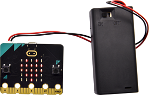

external power（3V）

#### Step 5: other programming languages

This chapter has described how to use the Micro: Bit main board V2.

But except for the Makecode graphical programming introduced you can also write Micro: Bit programs in other languages. Go to the link: [https://microbit.org/code/](https://microbit.org/code/) to know about other programming languages, or view the link: [https://microbit.org/projects/](https://microbit.org/projects/), to find something you want to have a go.

### 5.2 Makecode

Browse [https://makecode.microbit.org/](https://makecode.microbit.org/) and enter Makecode online editor or open the APP MakeCode for micro:bit of Windows 10.

Click , and input “heartbeat”, then enter Makecode editor, as shown below:

There are block  and  in the code editing area.

When the power is plugged or reset, “on start” means that blocks in the code are only executed once, “forever” implies that code will run cyclically.

### 5.3. Quick Download

As mentioned before, if your computer is Windows 10 and you have downloaded the APP MakeCode for micro:bit to write programs, the program written can be quickly downloaded to the Micro: Bit main board V2 by selecting .

While it is a little more trickier if you are using a browser to enter makecode. However, if you use Google Chrome, suitable for Linux, macOS and Windows 10, the process can be quicker too.

We use the webUSB function of Chrome to allow the internet page to access the hardware device connected USB.

You could refer to the following steps to connect and pair devices.

**Pairing device**

Connect micro:bit to your computer by USB cable. Click  beside “Download” and click .

Then click another  as shown below.

Tap “BBC micro:bit CMSIS-DPA” and click .  If  does not show up for selection, please refer to [https://makecode.microbit.org/device/usb/webusb/troubleshoot](https://makecode.microbit.org/device/usb/webusb/troubleshoot)

We also provide in the resource link.

What’s more, if you don’t know how to update the firmware of micro:bit, refer to the link: [https://microbit.org/guide/firmware/](https://microbit.org/guide/firmware/) or browse folderwe provide.

Then click . The program is directly downloaded to Micro: Bit main board V2 and the sentence “Download completed!” appears.

### 5.4 Resources and test code

Tools ,test code and other resources can be downloaded via the link [https://fs.keyestudio.com/KS4022-4023](https://fs.keyestudio.com/KS4022-4023)

Download and unzip the file, you will see a file clip named KS4022 (4023)EASY Plug Ultimate Starter Kit for BBC Micro:bit STEM EDU, and it contains following files:

### 5.5 Import test code

We provide hexadecimal code files (project files) for each project. The file contains all the contents of the project and can be imported directly, or you can manually drag the code blocks to complete the program for each project. 

For simple projects, dragging a block of code to complete the program is recommended. For complex projects, it is recommended to conduct the program by importing the hexadecimal code file we provide.

Let's take the "Heatbeat" project as an example to show how to load the code.

Open the Web version of Makecode or the Windows 10 App version of Makecode.

Click “Import File”;

Select “ ../Makecode Code/Project 1\_ Heart beat/Project 1\_ Heart beat.hex” ;

Then click .

In addition to importing the test code file provided into the Makecode compiler above, you can also drag the the test code file provided into the code editing area of the Makecode compiler, as shown in the figure below:

After a few seconds, it is done.

Note: if your computer system is Windows 7 or 8 instead of Windows 10, the pairing cannot be done via Google Chrome. Therefore, digital signal or analog signal of sensors and modules cannot be shown on the serial port simulator. However, you need to read the corresponding digital signal or analog signal.

So what can we do? You can use the CoolTerm software to read the serial port data of the micro:bit. Next chapter is about how to install CoolTerm.

### 5.6 CoolTerm Installation

CoolTerm program is used to read the data on serial port.

**Download CoolTerm program:**

Link of Download: [https://freeware.the-meiers.org/](https://freeware.the-meiers.org/)

1.After the download, we need to install CoolTerm program file, below is Window system taken as an example.
    
2.Choose “win” to download the zip file of CoolTerm

3.Unzip file and open it. (also suitable for Mac and Linux system)

4.Double-click .

The functions of each button on the Toolbar are listed below:

|                      ICON                       | Function                                         |
| :---------------------------------------------: | ------------------------------------------------ |
|  | Opens up a new Terminal                          |
|  | Opens a saved Connection                         |
|  | Saves the current Connection to disk             |
|  | Opens the Serial Connection                      |
|  | Closes the Serial Connection                     |
|  | Clears the Received Data                         |
|  | Opens the Connection Options Dialog              |
|  | Displays the Terminal Data in Hexadecimal Format |
|  | Displays the Help Window                         |

## 6. Projects 

(Note: project 1 to 12 will be conducted with the built-in sensors and LED dot matrix of the Micro:bit main board V2)

### Project 1: Heartbeat

#### 1. Project Description: 

This project is easy to conduct with a micro:bit V2 main board, a Micro USB cable and a computer. The micro:bit LED dot matrix will display a relatively big heart-shaped pattern and then a smaller one. This alternative change of this pattern is like heart beating. This experiment serves as a starter for your entry to the programming world.

####  2. Components Needed: 

-   Micro:bit main board V2 \*1

-   Micro USB cable\*1

#### 3. Test Code: 

Attach the Micro:bit main board V2 to your computer via the Micro USB cable and begin editing.

Firstly, click  and find and drag the block to “forever”;

Secondly, click   again and find and drag the block  to module “forever” and click the little triangle to select ;

Thirdly, click  and find and drag the block  to the code block and click the littler triangle to select 500;

**Complete Program：**

|  | ①In“on start”the program only runs once;    ②In”forever”the program runs cyclically;   ③The LED dot matrix displays pattern “”;  ④The LED dot matrix displays pattern“” |
| ------------------------------------------------------------ | ------------------------------------------------------------ |

Note: the “on start” means that blocks in the code are only executed once, “forever” implies that code will run cyclically.

Click , you will find the corresponding programming languages.

Click  to choose , you will find the corresponding Python programming languages.

#### 4. Test Results: 

Uploading test code to micro:bit main board V2 and keeping the connection with the computer to power the main board, the LED dot matrix shows pattern “”and then “”alternatively.

(Please refer to chapter 5.3 to know how to download test code quickly.) 

If the downloading is not smooth, please remove the micro USB from the main board and then reconnect them and reopen Makecode to try again.

### Project 2: Light A Single LED

#### 1. Project Description: 

The LED dot matrix consists of 25 LEDs arranged in a 5 by 5 square. In order to locate these LEDs quickly, as the figure shown below, we can regarded this matrix as a coordinate system and create two aces by marking those in rows from 0 to 4 from top to bottom, and the ones in columns from 0 to 4 from the left to the right. Therefore, the LED sat in the second of the first line is (1,0）and the LED positioned in the fifth of the fourth column is (3,4）and others likewise.

#### 2. Components Needed: 

-   Micro:bit main board V2 \*1

-   Micro USB cable\*1

#### 3. Test Code: 

Attach the Micro:bit main board V2 to your computer via the Micro USB cable and begin editing.

Firstly, click  and then the  to find and drag the block  to block “on start”; and click  to select ;

Secondly, click  and to find and drag the block  to block “forever” and alter “x0” to”x1”;

Thirdly, click  to find and drag the block  to “forever” block and set pause to 500;

Fourthly, copy the block  and place it into "forever” block;

Fifthly, click   to find and drag the block  to “forever” block and change the “x 0 y 0” to “x 3 y 4”;

Sixthly, copy the block “pause(ms)500” and place it into "forever” block;

Lastly, click  to find and drag the block  to “forever” and change “x 0 y 0” to “x 3 y 4”; and copy and place the block “pause(ms)500” to block “forever”;
 
**Complete Program：**

|   | ①In“on start”the program only runs once; ②Open the LED dot matrix on the micro:bit board;   ③In“forever”the program runs cyclically;  ④Change the brightness of the LED positioned in (1,0) ⑤Delay in 500ms;  ⑥Change the brightness of the LED positioned in (1,0) ⑦Delay in 500ms;  ⑧Change the brightness of the LED positioned in (3,4) ⑨Delay in 500ms;  ⑩Turn off the LED in(3,4); ⑪Delay in 500ms; |
| ------------------------------------------------------------ | ------------------------------------------------------------ |

Click , you will find the corresponding programming languages.

Click  to choose , you will find the corresponding Python programming languages.

#### 4. Test Results 

Uploading test code to micro:bit main board V2 and powering the main board via the USB cable, the LED in (1,0) lights up for 0.5s and the one in (3,4) shines for 0.5s and repeat this sequence.

### Project 3: LED Dot Matrix

#### 1. Project Description: 

Dot matrices are very commonplace in daily life. They have found wide applications in LED advertisement screens, elevator floor display, bus stop announcement and so on.

The LED dot matrix of Micro: Bit main board V2 contains 25 LEDs in a grid. Previously, we have succeeded in controlling a certain LED to light by integrating its position value into the test code. Supported by the same theory, we can turn on many LEDs at the same time to showcase patterns, digits and characters.

What’s more, we can also click”show icon“ to choose the pattern we like to display. Last but not the least, we can our design patterns by ourselves.

#### 2. Components Needed: 

-   Micro:bit main board V2 \*1

-   Micro USB cable\*1

#### 3. Test Code 1: 

Link computer with micro:bit board by micro USB cable, and program in MakeCode editor.

Enter  →  → ; Click  to select : 

Combine it with “on start” block

\*\*\*\*\*\*\*\*\*\*\*\*\*\*\*\*\*\*\*\*\*\*\*\*\*\*\*\*\*\*\*\*\*\*\*\*\*\*\*\*\*\*\*\*\*\*\*\*\*\*\*\*\*\*\*\*\*\*\*\*\*\*\*\*\*

Click  to move  into“forever”, then replicate  for 8 times, respectively set to“x 2”y 0”, “x 2”y 1”, “x 2”y 2”, “x 2”y 3”, “x2”y 4”, “x 1”y 3”, “x 0”y 2”, “x 3”y 3”, “x 4”y 2”.

**Complete Program：**

|  | “on start”: command block only runs once to start program.  Turn on LED dot matrix.   The program under the block “forever” runs cyclically.  Toggle the LED brightness at coordinate point:  “x 2，y 0”, “x 2，y 1”, “x 2，y 2”,  “x 2，y 3”, “x 2，y 4”, “x 1，y 3”,  “x 0，y 2”, “x 3，y 3”, “x 4，y 2”. |
| ----------------------------------------------- | ------------------------------------------------------------ |

Select  and  to switch into JavaScript and Python code:

#### 4. Test Results 1: 

Upload code 1 and power on , we will see the  icon.

#### 5. Test Code 2: 

Link computer with micro:bit board by micro USB cable, and program in MakeCode editor.

Enter  →  → Duplicate it for 4 times, separately set number to 1, 2, 3, 4, 5.

\*\*\*\*\*\*\*\*\*\*\*\*\*\*\*\*\*\*\*\*\*\*\*\*\*\*\*\*\*\*\*\*\*\*\*\*\*\*\*\*\*\*\*\*\*\*\*\*\*\*\*\*\*\*\*\*\*\*\*\*\*\*\*\*\*

Click  →  → put it into “forever” block, tick blue boxes to light LED and generate “↓” pattern.

\*\*\*\*\*\*\*\*\*\*\*\*\*\*\*\*\*\*\*\*\*\*\*\*\*\*\*\*\*\*\*\*\*\*\*\*\*\*\*\*\*\*\*\*\*\*\*\*\*\*\*\*\*\*\*\*\*\*\*\*\*\*\*\*\*

Move out the block  from  block, and leave it beneath the  block.

Choose  from , and leave it beneath 

\*\*\*\*\*\*\*\*\*\*\*\*\*\*\*\*\*\*\*\*\*\*\*\*\*\*\*\*\*\*\*\*\*\*\*\*\*\*\*\*\*\*\*\*\*\*\*\*\*\*\*\*\*\*\*\*\*\*\*\*\*\*\*\*\*

Enter  →  → replicate for 3 times, respectively set to “North East”, “South East”, “South West” “North West”.

Click  to get  then remain it below 

\*\*\*\*\*\*\*\*\*\*\*\*\*\*\*\*\*\*\*\*\*\*\*\*\*\*\*\*\*\*\*\*\*\*\*\*\*\*\*\*\*\*\*\*\*\*\*\*\*\*\*\*\*\*\*\*\*\*\*\*\*\*\*\*\*

Drag  from  and set to 500ms, then leave it below .

**Complete Program:**

| 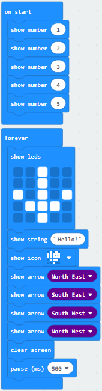 | “on start”:  command block only runs once to start program.  LED dot matrix displays 1,2,3,4,5   Under the block “forever”， program runs cyclically.  Dot matrix shows the“↓” pattern  Dot matrix scrolls to show “Hello!”  “❤”is shown on dot matrix  LED dot matrix displays “North East” arrow.  The “South East” arrow shows up on LED dot matrix  The “South West” arrow appears up on LED dot matrix  The“North West”arrow is displayed on LED dot matrix  Clear the screen  Delay in 500ms |
| ----------------------------------------------- | ------------------------------------------------------------ |

Select  and  to switch into JavaScript and Python code:

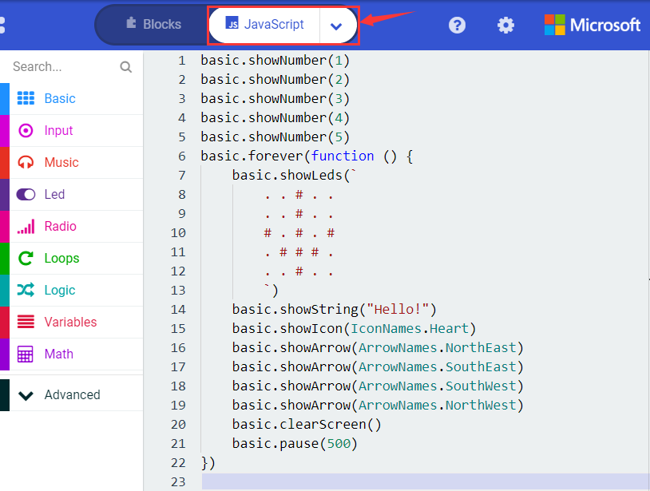

#### 6. Test Results 2: 

Upload code 2 and plug micro:bit to power. Micro: bit starts showing number 1, 2, 3, 4, and 5, then cyclically display,“Hello!”, , , ,  and patterns.

### Project 4: Programmable Buttons

#### 1. Project Description: 

Buttons can be used to control circuits. In an integrated circuit with a button, the circuit is connected when pressing the button and it is open the other way around.

Micro: Bit main board V2 boasts three buttons, two are programmable buttons(marked with A and B), and the one on the other side is a reset button. By pressing the two programmable buttons can input three different signals. We can press button A or B alone or press them together and the LED dot matrix shows A,B and AB respectively. Let’s get started.

#### 2. Components Needed: 

-   Micro:bit main board V2 \*1

-   Micro USB cable\*1

#### 3. Test Code 1: 

Link computer with micro:bit board by micro USB cable, and program in MakeCode editor,

Delete “on start” and “forever” firstly，then click  → 

\*\*\*\*\*\*\*\*\*\*\*\*\*\*\*\*\*\*\*\*\*\*\*\*\*\*\*\*\*\*\*\*\*\*\*\*\*\*\*\*\*\*\*\*\*\*\*\*\*\*\*\*\*\*\*\*\*\*\*\*\*\*\*\*\*

A. Click  →  

B. Then place it into “on button A pressed”, change “Hello!” into “A”.

Copy code stringonce, tap the drop-down button “A” to select “B” and modify character “A” into “B”.

\*\*\*\*\*\*\*\*\*\*\*\*\*\*\*\*\*\*\*\*\*\*\*\*\*\*\*\*\*\*\*\*\*\*\*\*\*\*\*\*\*\*\*\*\*\*\*\*\*\*\*\*\*\*\*\*\*\*\*\*\*\*\*\*\*

1.  Copyonce，and set to“on
    button A+B pressed”and“show string “AB”

\*\*\*\*\*\*\*\*\*\*\*\*\*\*\*\*\*\*\*\*\*\*\*\*\*\*\*\*\*\*\*\*\*\*\*\*\*\*\*\*\*\*\*\*\*\*\*\*\*\*\*\*\*\*\*\*\*\*\*\*\*\*\*\*\*

**Complete Code:**

|  | Press button A on Micro: bit main board  Show the character “A”   Press button B on Micro: bit main board  Show the character “B”   Press button A and B at same time   Display the character “AB” |
| ----------------------------------------------- | ------------------------------------------------------------ |

Select “JavaScript" and “Python” to switch into JavaScript and Python language code:

#### 4. Test Results 1: 

Uploading test code 1 to micro:bit main board V2 and powering the main board via the USB cable, the 5\*5 LED dot matrix shows A if button A is pressed, B if button B pressed, and AB if button A and B pressed together.

#### 5. Test Code 2: 

A. Click “Led” → “more” → “led enable false”,

B. Put it into the block “on start”, click drop-down triangle button to select “true” .

\*\*\*\*\*\*\*\*\*\*\*\*\*\*\*\*\*\*\*\*\*\*\*\*\*\*\*\*\*\*\*\*\*\*\*\*\*\*\*\*\*\*\*\*\*\*\*\*\*\*\*\*\*\*\*\*\*\*\*\*\*\*\*\*\*

A. Tap “Variables” → “Make a Variable...” → “New variable name：”

B. Enter “item” in the dialog box and click “OK”，then variable “item” is produced. And move“set item to 0”into“on start”block

\*\*\*\*\*\*\*\*\*\*\*\*\*\*\*\*\*\*\*\*\*\*\*\*\*\*\*\*\*\*\*\*\*\*\*\*\*\*\*\*\*\*\*\*\*\*\*\*\*\*\*\*\*\*\*\*\*\*\*\*\*\*\*\*\*

A. Click “Input” → “on button A pressed”.

B. Go to “Variables”→“ change item by 1 ”

C. Place it into“on button A pressed”and 1 is modified into 5.

\*\*\*\*\*\*\*\*\*\*\*\*\*\*\*\*\*\*\*\*\*\*\*\*\*\*\*\*\*\*\*\*\*\*\*\*\*\*\*\*\*\*\*\*\*\*\*\*\*\*\*\*\*\*\*\*\*\*\*\*\*\*\*\*\*

Duplicatecode string once，click the drop-down button to select“B”，then set“change item by
\-5”.

\*\*\*\*\*\*\*\*\*\*\*\*\*\*\*\*\*\*\*\*\*\*\*\*\*\*\*\*\*\*\*\*\*\*\*\*\*\*\*\*\*\*\*\*\*\*\*\*\*\*\*\*\*\*\*\*\*\*\*\*\*\*\*\*\*

A. Enter“Led”→“plot bar graph of 0 up to 0”

B. Keep it into“forever”block

C. Go to“Variables”to move“item”into 0 box，change 0 into 25.

\*\*\*\*\*\*\*\*\*\*\*\*\*\*\*\*\*\*\*\*\*\*\*\*\*\*\*\*\*\*\*\*\*\*\*\*\*\*\*\*\*\*\*\*\*\*\*\*\*\*\*\*\*\*\*\*\*\*\*\*\*\*\*\*\*

(6)A. Go to“Logic”to move out “if...true...then...”and “=”blocks，

B. Keep“=”into“true”box and set to “\>”

C. Select“item”in the“Variables”and lay it down at left box of “\>”，change 0 into 25；

D. Enter“Variables”to drag“set item to 0”block into“if...true..then...”, alter 0 into 25.

\*\*\*\*\*\*\*\*\*\*\*\*\*\*\*\*\*\*\*\*\*\*\*\*\*\*\*\*\*\*\*\*\*\*\*\*\*\*\*\*\*\*\*\*\*\*\*\*\*\*\*\*\*\*\*\*\*\*\*\*\*\*\*\*\*

(7) A. Replicate code stringonce

B.“\>” is modified into “\<” and 25 is changed into 0,

C. Leave it beneath code string.

**Complete Program：**

|  | “on start”:  command block runs once to start program.  Turn on LED dot matrix Set the initial value of item to 0   Press button A on Micro:bit board Change item by 5   Press button B on Micro:bit board Change item by -5   The program under the block “forever” runs cyclically.  Light on LED in dot matrix to draw bar graph,  light up up to 25 LEDs  If item is greater than 25 Then set item to 25  If item is less than 0 Then Set item to 0 |
| ----------------------------------------------- | ------------------------------------------------------------ |

Select“JavaScript" and“Python”to switch into JavaScript and Python language code:

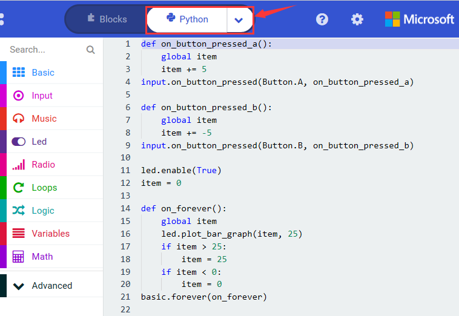

#### 6. Test Results 2: 

Uploading test code 2 to micro:bit main board V2 and powering the main board via the USB cable, when pressing the button A the LEDs turning red increase while when pressing the button B the LEDs turning red reduce.

### Project 5: Temperature Detection

#### 1. Project Description: 

Actually ,the Micro:bit main board V2 is not equipped with a temperature sensor, but uses the temperature sensor built into NFR52833 chip for temperature detection. Therefore, the detected temperature is more closer to the temperature of the chip, and there maybe deviation from the ambient temperature.

#### 2. Components Needed: 

-   Micro:bit main board V2 \*1

-   Micro USB cable\*

#### 3. Test Code 1: 

Click “Advanced” → ”Serial” → “serial redirect to USB” into “on start”

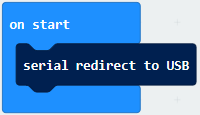

\*\*\*\*\*\*\*\*\*\*\*\*\*\*\*\*\*\*\*\*\*\*\*\*\*\*\*\*\*\*\*\*\*\*\*\*\*\*\*\*\*\*\*\*\*\*\*\*\*\*\*\*\*\*\*\*\*\*\*\*\*\*\*\*\*

Go to “Serial” → “serial write value “x”=0” into “forever”

Click “Input” → “temperature(℃)” into “serial write value“x”=0 and change”0”into “temperature”

\*\*\*\*\*\*\*\*\*\*\*\*\*\*\*\*\*\*\*\*\*\*\*\*\*\*\*\*\*\*\*\*\*\*\*\*\*\*\*\*\*\*\*\*\*\*\*\*\*\*\*\*\*\*\*\*\*\*\*\*\*\*\*\*\*

Go to“Basic”→“pause (ms) 100”into “forever”and set pause to 500

\*\*\*\*\*\*\*\*\*\*\*\*\*\*\*\*\*\*\*\*\*\*\*\*\*\*\*\*\*\*\*\*\*\*\*\*\*\*\*\*\*\*\*\*\*\*\*\*\*\*\*\*\*\*\*\*\*\*\*\*\*\*\*\*\*

**Complete Program：**

|  | ①In“on start”the program only runs once; ②Redirect serial to USB;  ③In“forever”the program runs cyclically; ④The serial writes the temperature value detected by the sensor; ⑤Delay in 50ms. |
| ----------------------------------------------- | ------------------------------------------------------------ |

Select“JavaScript" and“Python”to switch into JavaScript and Python language code:

#### 4. Test Results 1: 

Uploading test code 1 to micro:bit main board V2, powering the main board via the USB cable, and clicking “Show console Device”, the data of temperature shows in the serial monitor page as shown below.

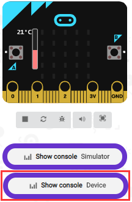

If you're running Windows 7 or 8 instead of Windows 10, via Google Chrome won't be able to match devices. You'll need to use the CoolTerm serial monitor software to read data.

You could open CoolTerm software, click Options, select SerialPort, set COM port and baud rate to 115200 (after testing, the baud rate of USB SerialPort communication on Micro: Bit main board V2 is 115200), click OK, and Connect. The CoolTerm serial monitor shows the change of temperature in the current environment, as shown in the figures below :

#### 5. Test Code 2: 

Link computer with micro:bit board by micro USB cable, and program in MakeCode editor,

A. Go to“Led”→“more”→“led enable false”block,

B. Keep it into the“on start”block，tap the triangle button to select“true”.

\*\*\*\*\*\*\*\*\*\*\*\*\*\*\*\*\*\*\*\*\*\*\*\*\*\*\*\*\*\*\*\*\*\*\*\*\*\*\*\*\*\*\*\*\*\*\*\*\*\*\*\*\*\*\*\*\*\*\*\*\*\*\*\*\*

Tap “Logic” and drag “if...then...else” into “forever” block; and then drag “=” into “true”

Enter “Input” to move “temperature(℃)” into the left side of “=”; click the little triangle of “=” to choose “≥”, and change the “0” to “35”

Click“Basic”to find out block“show icon”and move it into“then”; copy and place the block“show icon”to “else”and click the little triangle of “”to select “”

**Complete Program：**

|  | ①In“on start”the program only runs once; ②Open the LED dot matrix on the micro:bit board;  ③In“forever”the program runs cyclically; ④When the condition that the detected temperature is ≥35℃,  the program in then runs; ⑤LED dot matrix displays pattern“”; ⑥When the condition that the detected temperature is not ≥35℃,  the program in else runs; ⑦LED dot matrix displays pattern“”. |
| ------------------------------------------------------------ | ------------------------------------------------------------ |

Select“JavaScript" and“Python”to switch into JavaScript and Python language code:

#### 6. Test Results 2: 

Uploading the code 2, when the ambient temperature is less than 35℃, 5\*5LED will show. When the temperature is equivalent to or greater than 35℃, the pattern will appear.

### Project 6: Geomagnetic Sensor

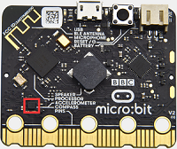

#### 1. Project Description: 

This project aims to explain the use of the Micro: bit geomagnetic sensor, which can not only detect the strength of the geomagnetic field, but also be used as a compass to find bearings. It is also an important part of the navigation attitude reference system (AHRS). Micro: Bit main board V2 uses LSM303AGR geomagnetic sensor, and the dynamic range of magnetic field is ±50 gauss. In the board, the magnetometer module is used in both magnetic detection and compass. In this experiment, the compass will be introduced first, and then the original data of the magnetometer will be checked.

The main component of a common compass is a magnetic needle, which can be rotated by the geomagnetic field and point toward the geomagnetic North Pole (which is near the geographic South Pole) to determine direction.

#### 2. Components Needed: 

-   Micro:bit main board V2 \*1

-   Micro USB cable\*1

#### 3. Test Code 1: 

Link computer with micro:bit board by micro USB cable, and program in MakeCode editor.

A. Click“Input”→“more”→“calibrate compass”

B. Lay down it into block“on start”.

A. Go to“Input”→“on button A pressed”.

B. Enter“Basic”→“show number”, put it into“on button A pressed”block;

C. Tap“Input”→“compass heading(℃)”， and place it into“show number”

\*\*\*\*\*\*\*\*\*\*\*\*\*\*\*\*\*\*\*\*\*\*\*\*\*\*\*\*\*\*\*\*\*\*\*\*\*\*\*\*\*\*\*\*\*\*\*\*\*\*\*\*\*\*\*\*\*\*\*\*\*\*\*\*\*

**Complete Program：**

|  | ①“on start”: command block only runs once to start program. ②Calibrate compass  ③Press button A on Micro:bit main board ④Dot matrix shows the direction of compass heading |
| ----------------------------------------------- | ------------------------------------------------------------ |

Select“JavaScript" and“Python”to switch into JavaScript and Python language code:

#### 4. Test Results 1: 

Uploading test code to micro:bit main board V2 and powering the board via the USB cable, and pressing the button A, the board asks us to calibrate compass and the LED dot matrix shows “TILT TO FILL SCREEN”. Then enter the calibration page. Rotate the board until all 25 LEDs are on red as shown below.

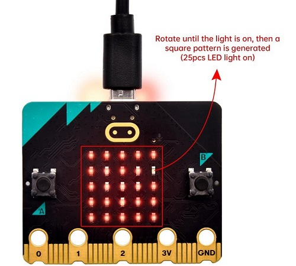

After that, a smile pattern  appears, which implies the calibration is done. When the calibration process is completed, pressing the button A will make the magnetometer reading display directly on the screen. And the direction north, east, south and west correspond to 0°, 90°, 180° and 270°.

#### 5. Test Code 2: 

This module can keep readings to determine direction, so does point to the current magnetic North Pole by arrow.

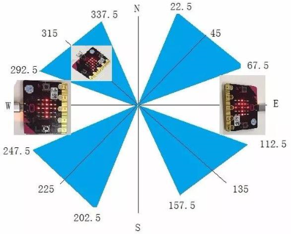

For the above picture, the arrow pointing to the upper right when the value ranges from 292.5 to 337.5. 0.5 can’t be input in the code, thereby, the values we get are 293 and 338.

Link computer with micro:bit board by micro USB cable, and program in MakeCode editor,

Enter“Input”→ “more”→“calibrate compass”. Move“calibrate compass”into“on start”

\*\*\*\*\*\*\*\*\*\*\*\*\*\*\*\*\*\*\*\*\*\*\*\*\*\*\*\*\*\*\*\*\*\*\*\*\*\*\*\*\*\*\*\*\*\*\*\*\*\*\*\*\*\*\*\*\*\*\*\*\*\*\*\*\*

A. Click“Variables”→“Make a Variable...”→“New variable name：”

B. Input“x”in the blank box and click“OK”, and the variable “x” is generated.

C. Drag out“set x to”into“forever”block

Go to“Input”→“compass heading(℃)”, and keep it into“0”box

Tap“Logic”→“if...then...else”, leave it below block“sex x to compass heading”, then clickicon for 6 times.

\*\*\*\*\*\*\*\*\*\*\*\*\*\*\*\*\*\*\*\*\*\*\*\*\*\*\*\*\*\*\*\*\*\*\*\*\*\*\*\*\*\*\*\*\*\*\*\*\*\*\*\*\*\*\*\*\*\*\*\*\*\*\*\*\*

A. Place“and”into“true”block

B. Then move“=”block to the left box of “and”

C. Click“Variables”to drag“x”to the left “0”box, change 0 into 293 and set to “≥”;

D. Then copy“x≥293”once and leave it to the right “0”box and set to“x\<338”

\*\*\*\*\*\*\*\*\*\*\*\*\*\*\*\*\*\*\*\*\*\*\*\*\*\*\*\*\*\*\*\*\*\*\*\*\*\*\*\*\*\*\*\*\*\*\*\*\*\*\*\*\*\*\*\*\*\*\*\*\*\*\*\*\*

A. Go to“Basic”→“show leds”

B. Lay it down beneath block,
then click“show leds”and the pattern appears.

A. Duplicate for 6 times.

B. Separately leave them into the blank boxes behind “else if”.

C. Set to“x≥23 and x\<68”,“x≥68 and x\<113 ”,“x≥113 and x\<158 ”,“x≥158 and x\<203 ”,“x≥203 and x\<248 ”,“x≥248 and x\<293 ”respectively.

D. Then copy “show leds”for 7 times and keep them below the “else if.......then” block respectively.

E. Click the blue boxes to form the pattern“”, “”, “”, “”, “”, “”and “”.

\*\*\*\*\*\*\*\*\*\*\*\*\*\*\*\*\*\*\*\*\*\*\*\*\*\*\*\*\*\*\*\*\*\*\*\*\*\*\*\*\*\*\*\*\*\*\*\*\*\*\*\*\*\*\*\*\*\*\*\*\*\*\*\*\*\*\*\*\*\*\*\*\*\*\*\*\*

**Complete Program：**

|  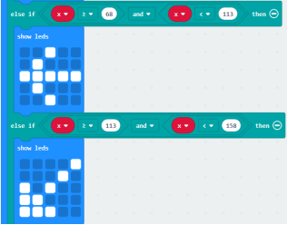   | “on start”: command block only runs once to start program.  Calibrate compass   The program under the block “forever” runs cyclically.  Store the angle of the compass heading into the variable x  When 293≤x<338, the next program will be executed appears on the dot matrix  When 23≤x<68, the next program will be executed is displayed on dot matrix  When 68≤x<113, the next program will be executed  is shown on dot matrix  When 113≤x<158, the next program will be executed pattern appears  When 158≤x<203, the next program will be executed. Dot matrix shows   When 203≤x<248,  the next program will be executed. Dot matrix displays   When 248≤x<293, the next program will be executed. Dot matrix shows   When x is not among the above rang,  the next program will be executed under else block |
| ------------------------------------------------------------ | ------------------------------------------------------------ |

Select“JavaScript" and“Python”to switch into JavaScript and Python language
code:

#### 6. Test Results 2: 

Upload code 2 and plug micro:bit to power. After calibration, tilt micro:bit board, the LED dot matrix displays the direction signs.

### Project 7: Accelerometer

#### 1. Project Description: 

The Micro: Bit main board V2 has a built-in LSM303AGR gravity acceleration sensor, also known as accelerometer, with a resolution of 8/10/12 bits. The code section sets the range to 1g, 2g, 4g, and 8g.

We often use accelerometer to detect the status of machines.

In this project, we will introduce how to measure the position of the board with the accelerometer. And then have a look at the original three-axis data output by the accelerometer.

#### 2. Components Needed: 

-   Micro:bit main board V2 \*1

-   Micro USB cable\*1

#### 3. Test Code 1: 

Link computer with micro:bit board by micro USB cable, and program in MakeCode editor,

(1) A. Enter“Input”→“on shake”，

B. Click“Basic”→“show number”, place it into“on shake”block, then change 0 into 1.

\*\*\*\*\*\*\*\*\*\*\*\*\*\*\*\*\*\*\*\*\*\*\*\*\*\*\*\*\*\*\*\*\*\*\*\*\*\*\*\*\*\*\*\*\*\*\*\*\*\*\*\*\*\*\*\*\*\*\*\*\*\*\*\*\*

(2) Copy code string for 7 times; separately click the triangle button to select“logo up”,“logo down”,“screen
up”,“screen down”,“tilt left”,“tilt right”and“free fall”, then respectively change 1 into 2, 3, 4, 5, 6, 7, 8.

\*\*\*\*\*\*\*\*\*\*\*\*\*\*\*\*\*\*\*\*\*\*\*\*\*\*\*\*\*\*\*\*\*\*\*\*\*\*\*\*\*\*\*\*\*\*\*\*\*\*\*\*\*\*\*\*\*\*\*\*\*\*\*\*\*

**Complete Program：**

|   | Shake the Micro:bit board LED dot matrix displays 1   The log is up   LED dot matrix displays 2   The logo is down   LED dot matrix displays 3   The screen is up LED dot matrix displays 4   The screen is down Number 5 is shown   The Micro:bit board is tilt to the left Number 6 is displayed   The Micro:bit board is tilt to the right Number7 is displayed   When the Micro:bit board is free fall LED dot matrix shows 8 |
| ------------------------------------------------------------ | ------------------------------------------------------------ |

Select“JavaScript" and“Python”to switch into JavaScript and Python language code:

#### 4. Test Results 1: 

Uploading the test code 1 to micro:bit main board V2 and powering the board via the USB cable, if we shake the Micro: Bit main board V2. no matter at any direction, the LED dot matrix displays the digit “1”.

When it is kept upright （its logo above the LED dot matrix）, the number 2 will show.

When it is kept upside down( its logo below the LED dot matrix) , it will show as below.

When it is placed still on the desk, showing its front side, the number 4 appears.

When it is placed still on the desk, showing its back side, the number 5 will exhibit.

When the board is tilted to the left , the LED dot matrix shows the number 6 as shown below.

When the board is tilted to the right , the LED dot matrix displays the number 7 as shown below

When the board is knocked to the floor, this process can be considered as a free fall and the LED dot matrix shows the number 8. (please note that this test is not recommended for it may damage the main board.)

Attention: if you’d like to try this function, you can also set the acceleration to 3g, 6g or 8g. But still ,we don not recommend.

#### 5. Test Code 2: 

A. Go to“Advanced”→“Serial”→“serial redirect to USB”

B. Drag it into“on start”

\*\*\*\*\*\*\*\*\*\*\*\*\*\*\*\*\*\*\*\*\*\*\*\*\*\*\*\*\*\*\*\*\*\*\*\*\*\*\*\*\*\*\*\*\*\*\*\*\*\*\*\*\*\*\*\*\*\*\*\*\*\*\*\*\*

A. Enter“Serial”→“serial write value x =0”

B. Leave it into“forever”block

\*\*\*\*\*\*\*\*\*\*\*\*\*\*\*\*\*\*\*\*\*\*\*\*\*\*\*\*\*\*\*\*\*\*\*\*\*\*\*\*\*\*\*\*\*\*\*\*\*\*\*\*\*\*\*\*\*\*\*\*\*\*\*\*\*

A. Click“Input”→“acceleration(mg) x”；

B. Keep it into“0”box and capitalize the“x”

\*\*\*\*\*\*\*\*\*\*\*\*\*\*\*\*\*\*\*\*\*\*\*\*\*\*\*\*\*\*\*\*\*\*\*\*\*\*\*\*\*\*\*\*\*\*\*\*\*\*\*\*\*\*\*\*\*\*\*\*\*\*\*\*\*

Go t“Basic”and move out“pause (ms) 100”below the block, then set to 100ms.

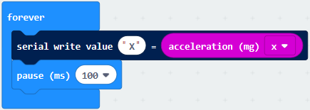

\*\*\*\*\*\*\*\*\*\*\*\*\*\*\*\*\*\*\*\*\*\*\*\*\*\*\*\*\*\*\*\*\*\*\*\*\*\*\*\*\*\*\*\*\*\*\*\*\*\*\*\*\*\*\*\*\*\*\*\*\*\*\*\*\*

Replicate code string for 3 times and keep them into“forever”block，separately set the whole code string as follows:

**Complete Program：**

|  | “on start”:  command block runs once to start program. Serial redirects to USB  The program under the block “forever” runs cyclically.  Serial write value “X”=acceleration value on x axis Delay 100ms Serial write value “Y”=acceleration value on y axis Delay 100ms Serial write value “Z”=acceleration value on z axis Delay 100ms Serial write value “S”=acceleration value on s axis Delay 100ms |
| ----------------------------------------------- | ------------------------------------------------------------ |

Select“JavaScript" and“Python”to switch into JavaScript and Python language code:

#### 6. Test Results 2: 

Upload test code to micro:bit main board V2, power the main board via the USB cable, and click “Show console Device”.

After referring to the MMA8653FC data manual and the hardware schematic diagram of the Micro: Bit main board V2, the accelerometer coordinate of the Micro: Bit V2 motherboard are shown in the figure below:

The following interface shows the decomposition value of acceleration in X axis, Y axis and Z axis respectively, as well as acceleration synthesis (acceleration synthesis of gravity and other external forces).

If you're running Windows 7 or 8 instead of Windows 10, via Google Chrome won't be able to match devices. You'll need to use the CoolTerm serial monitor software to read data.

You could open CoolTerm software, click Options, select SerialPort, set COM port and baud rate to 115200 (after testing, the baud rate of USB SerialPort communication on Micro: Bit main board V2 is 115200), click OK, and Connect. The CoolTerm serial monitor shows the data of X axis, Y axis and Z axis , as shown in the figures below :

### Project 8: Light Detection

#### 1. Project Description: 

In this project, we focus on the light detection function of the Micro: Bit main board V2. It is achieved by the LED dot matrix. And it can be viewed as a photosensor.

#### 2. Components Needed: 

-   Micro:bit main board V2 \*1

-   Micro USB cable\*1

#### 3. Test Code: 

Link computer with micro:bit board by micro USB cable, and program in MakeCode editor,

(1)A. Enter“Advanced”→“Serial”→“serial redirect to USB”;

B. Drag it into“on start”block.

\*\*\*\*\*\*\*\*\*\*\*\*\*\*\*\*\*\*\*\*\*\*\*\*\*\*\*\*\*\*\*\*\*\*\*\*\*\*\*\*\*\*\*\*\*\*\*\*\*\*\*\*\*\*\*\*\*\*\*\*\*\*\*\*\*

(2) A. Go to“Serial”→“serial write value x =0”;

B. Move it into“forever”

A. Click“Input”→“acceleration(mg) x”

B. Put“acceleration(mg) x”in the“0”box and change “x”into“Light intensity”.

\*\*\*\*\*\*\*\*\*\*\*\*\*\*\*\*\*\*\*\*\*\*\*\*\*\*\*\*\*\*\*\*\*\*\*\*\*\*\*\*\*\*\*\*\*\*\*\*\*\*\*\*\*\*\*\*\*\*\*\*\*\*\*\*\*

A. Click“Basic”→“pause (ms) 100”;

B. Lay it down into“forever”and set to 100ms.

\*\*\*\*\*\*\*\*\*\*\*\*\*\*\*\*\*\*\*\*\*\*\*\*\*\*\*\*\*\*\*\*\*\*\*\*\*\*\*\*\*\*\*\*\*\*\*\*\*\*\*\*\*\*\*\*\*\*\*\*\*\*\*\*\*

**Complete Program：**

| 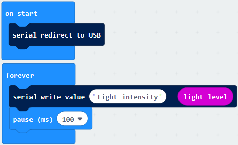 | “on start”:  command block runs once to start program. Serial redirects to USB  The program under the block “forever” runs cyclically. Serial write value “Light intensity”= light level Delay in 100ms |
| ----------------------------------------------- | ------------------------------------------------------------ |

Select“JavaScript" and“Python”to switch into JavaScript and Python language code:

#### 4. Test Results: 

Upload the test code to micro:bit main board V2, power the board via the USB cable and click“Show console Device”.

When the LED dot matrix is covered by hand, the light intensity showed is approximately 0; when the LED dot matrix is exposed to light,the light intensity displayed gets stronger with the light as shown below.

The 20 in the code is an arbitrary value of light intensity. If the current light level is less than or equal to 20, the moon will appear on the LED dot matrix. If it's bigger than 20, the sun will appear.

If you're running Windows 7 or 8 instead of Windows 10, via Google Chrome won't be able to match devices. You'll need to use the CoolTerm serial monitor software to read data.

You could open CoolTerm software, click Options, select SerialPort, set COM port and baud rate to 115200 (after testing, the baud rate of USB SerialPort communication on Micro: Bit main board V2 is 115200), click OK, and Connect. The CoolTerm serial monitor shows the value of light intensity , as shown in the figures below :

### Project 9: Speaker

####  1. Project Description: 

The Micro: Bit main board V2 has an built-in speaker, which makes adding sound to the programs easier. We can program the speaker to air all kinds of tones .

####  2. Components Needed: 

-   Micro:bit main board V2 \*1

-   Micro USB cable\*1

####  3. Test Code: 

Link computer with micro:bit board by micro USB cable, and program in MakeCode
editor,

(1) Enter“Basic”module to find “show icon”and drag it into “on start”block;

Click the little triangle to find “”

\*\*\*\*\*\*\*\*\*\*\*\*\*\*\*\*\*\*\*\*\*\*\*\*\*\*\*\*\*\*\*\*\*\*\*\*\*\*\*\*\*\*\*\*\*\*\*\*\*\*\*\*\*\*\*\*\*\*\*\*\*\*\*\*\*

(2) Enter“Music”module to find and drug“play sound giggle until done”into“forever”block;

Enter“Basic”module to find and drug“pause(ms) 100” into“forever”block ;

Change 100 into 1000;

( 3 ) Copy  three times and place it into “forever” block ;

Click the little triangle to select“happy”,”hello”,”yawn”;

\*\*\*\*\*\*\*\*\*\*\*\*\*\*\*\*\*\*\*\*\*\*\*\*\*\*\*\*\*\*\*\*\*\*\*\*\*\*\*\*\*\*\*\*\*\*\*\*\*\*\*\*\*\*\*\*\*\*\*\*

**Complete Program：**

|  | ①In “on start”the program only runs once;  ②LED dot matrix displays pattern“”;   ③In“forever”the program runs cyclically;  ④The buzzer makes the sound“giggle”; ⑤Delay in 1000ms;  ⑥The buzzer makes the sound“happy”; ⑦Delay in 1000ms;  ⑧The buzzer makes the sound“hello”; ⑨Delay in 1000ms;  ⑩The buzzer makes the sound“yawn”; ⑪Delay in 1000ms; |
| ------------------------------------------------------------ | ------------------------------------------------------------ |

Select “JavaScript" and “Python” to switch into JavaScript and Python language code:

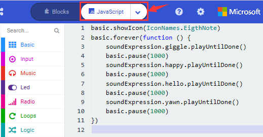

#### 4. Test Results: 

Uploading the test code to micro:bit main board V2 and powering the board via the USB cable, the speaker utters sound and the LED dot matrix shows the logo of music.

### Project 10: Touch-sensitive Logo

#### 1. Project Description: 

The Micro: Bit main board V2 is equipped with a golden touch-sensitive logo, which can act as an input component and function like an extra button.

It contains a capacitive touch sensor that senses small changes in the electric field when pressed (or touched), just like your phone or tablet screen do.When you press it , you can activate the program.

#### 2. Components Needed: 

-   Micro:bit main board V2 \*1

-   Micro USB cable\*1

#### 3. Test Code: 

Link computer with micro:bit board by micro USB cable, and program in MakeCode editor,

( 1 ) Delete block“on start”and“forever”;

( 2 )Enter“Input”module to find and drag“on logo pressed” ; Click the little triangle to find “touched”’;

( 3 ) Enter module“Variables”→choose“Make a Variable”→input “start”→click“OK”

The variable“start”is established;

Enter“Variables”module to find and drag“set start to 0”into“on logo touched”block;

( 4 )Enter“Input”module →click“more”→ find and drag“running time(ms)”into the“0”of“set start to 0”block;

( 5 )Enter“Basic”module to find and drag“show icon” into “on logo touched”block;

( 6 )Enter“Input”module to find and drag“on logo pressed”→choose “released”→ establish variable “time”;

( 7 )Enter“Variables”module to find and drag “set time to 0”into “on logo pressed”block;

( 8 )Enter“Math”module to find and drag “0-0”into the “0”of“set start to 0”block;

( 9 )Enter“Input”module→ “more” → find and drag “running time(ms) into“0”on the left side of “0-0”;

( 10 )Enter“Variables”module to find and drag“start” into “0”on the right side of “0-0”;

( 11 )Enter“Basic”module to find and drag“show number” into “on logo released”block;

( 12 )Enter“Math”module to find and drag“square root 0” into “0”;

( 13 )Click the little triangle to find”integer÷”;

( 14 )Enter“Variables”module to find and drag“time”into“0”on the left side of“0-0”and change the“0”on the right side to“1000”;

Complete Program：

|  | ①Touch the logo on the micro:bit with hand; ②Assign “running time” to variable”start”; ③LED dot matrix displays pattern“”;  ④Put your hand away from the logo; ⑤Assign “running time” to variable “time” ⑥LED dot matrix displays the integer of variable “time”divided by 1000. |
| ------------------------------------------------------------ | ------------------------------------------------------------ |

Select “JavaScript" and “Python” to switch into JavaScript and Python language code:

#### 4. Test Results: 

Uploading the test code to micro:bit main board V2 and powering the board via the USB cable, the LED dot matrix exhibits the heart pattern when the touch-sensitive logo is pressed or touched and displays digit when the logo is released.

### Project 11: Microphone

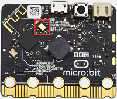

#### 1. Project Description: 

The Micro: Bit main board V2 is built with a microphone which can test the volume of ambient environment. When you clap, the microphone LED indicator will turn on. Since it can measure the intensity of sound, you can make a noise scale or disco lighting changing with music. The microphone is placed on the opposite side of the microphone LED indicator and in proximity with holes that lets sound pass.When the board detects sound, the LED indicator lights up.

#### 2. Components Needed: 

-   Micro:bit main board V2 \*1

-   Micro USB cable\*1

#### 3. Test Code 1: 

Link computer with micro:bit board by micro USB cable, and program in MakeCode editor,

Delete block“on start”and“forever”;

Enter“Input”module to find and drag“on loud sound”;

Enter“Basic”module to find and drag “show number”into “on loud sound”block ;

\*\*\*\*\*\*\*\*\*\*\*\*\*\*\*\*\*\*\*\*\*\*\*\*\*\*\*\*\*\*\*\*\*\*\*\*\*\*\*\*\*\*\*\*\*\*\*\*\*\*\*\*\*\*\*\*\*\*\*\*

Copy  once;

Click the little triangle of “lond” to choose”quiet”;

Click the little triangle of “” to choose””;

Complete Program：

|  | ①The microphone on the micro:bit detects sound; ②LED dot matrix displays pattern“”;  ③The microphone on the micro:bit detects no sound; ④LED dot matrix displays pattern“”. |
| ------------------------------------------------------------ | ------------------------------------------------------------ |

Select “JavaScript" and “Python” to switch into JavaScript and Python language code:

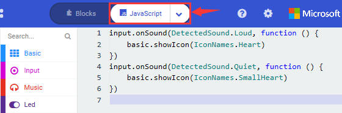

#### 4. Test Results 1: 

Uploading test code to micro:bit main board V2 and powering the board via the USB cable, the LED dot matrix displays pattern “”when you claps and pattern  when it is quiet around.

#### 5. Test Code 2: 

Link computer with micro:bit board by micro USB cable, and program in MakeCode editor,

Enter“Advanced”module→ choose“Serial”to find and drag“serial redirect to USB”into “on start”block ;

Enter“Variables”module→ choose“Make a Variable”→ input“maxSound”→click “OK”,variable ”maxSound”is established;

Enter“Variables”module to find and drag“set maxSound to 0”into “on start”block ;

Enter“Logic”module to find and drag“if true then...else”into“forever” block ;

Enter“Input”module to find and dragbutton A is pressed”into“then” ;

Enter“Basic”module to find and drag“show number”into “then” ;

Enter“Variables”module to find and drag“maxSound”into“0” ;

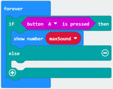

Establish variable“soundLevel”;

Enter“Variables”module to find and drag“set soundLevel to 0”into “else”;

Enter“Input”module to find and drag“sound level”into“0”;

Enter“Led”module to find and drag“plot bar graph of 0 up to 0” into “else”;

Enter“Variables”module to find and drag“soundLevel”into the“0”behind “of”;

Change the“0”behind“up” to“255”;

Enter“Logic”module to find and drag“if true then”into “else”block ;

Enter“Logic”module to find and drag“0 \> 0”into“then”;

Enter“Variables”module to find and drag“soundLevel”into“0”on the left side of“0-0” ;

Enter“Variables”module to find and drag“maxSound”into“0”on the right side;

Enter“Variables”module to find and drag“set maxSound to 0”into the second “then”;

Enter“Variables”module to find and drag“soundLevel”into the “0” ;

**Complete Program：**

|  | ①In “on start” the program only runs once; ②Redirect serial to USB; ③Set the initial value of variable “maxSound” to 0;  ④In “forever” the program runs cyclically;  ⑤When button A is pressed, the program in “then” runs; ⑥LED dot matrix displays the loudest sound value detected by the microphone sensor;  ⑦When above conditions are not true, the program in “else” runs; ⑧Assign sound value to variable”soundLevel”; ⑨LED dot matrix displays the brightness of LED;and the brightest value is 25; ⑩If the sound value detected is bigger than the loudest one in ambient environment  ⑪Then assign the sound value detected to variable”soundLevel”. |
| ----------------------------------------------- | ------------------------------------------------------------ |

Select “JavaScript" and“Python”to switch into JavaScript and Python language code:

#### 6. Test Results 2: 

Upload test code to micro:bit main board V2, power the board via the USB cable and click “Show console Device”as shown below.

When the sound is louder around, the sound value shows in the serial port is bigger as shown below.

What’s more, when pressing the button A, the LED dot matrix displays the value of the biggest volume( please note that the biggest volume can be reset via the Reset button on the other side of the board ) while when clapping, the LED dot matrix shows the pattern of the sound.

### Project 12: Bluetooth Wireless Communication

#### 1. Project Description: 

The Micro: Bit main board V2 comes with a nRF52833 processor (with built-in Bluetooth 5.1 BLE(Bluetooth Low Energy) device) and a 2.4GHz antenna for Bluetooth wireless communication and 2.4GHz wireless communication. With the help of them, the board is able to communicate with a variety of Bluetooth devices, including smart phones and tablets.

In this project, we mainly concentrate on the Bluetooth wireless communication function of this main board. Linked with Bluetooth, it can transmit code or signals. To this end, we should connect an Apple device (a phone or an iPad) to the board.

Since setting up Android phones to achieve wireless transmission is similar to that of Apple devices, no need to illustrate again.

#### 2. Preparation: 

\*Attach the Micro:bit main board V2 to your computer via the Micro USB cable.

\*An Apple device (a phone or an iPad) or an Android device;

#### 3. Procedures: 

For Apple devices, enter this link: [https://www.microbit.org/get-started/user-guide/ble-ios/](https://www.microbit.org/get-started/user-guide/ble-ios/) with your computer first, and then click “Download pairing HEX file”to download the Micro: Bit firmware to a folder or desk, and upload the downloaded firmware to the Micro: Bit main board V2.

Search“micro bit”in your App Store to download the APP micro:bit.

Wirelessly connect your iOS device to the micro: bit board V2:

Firstly, turn on the Bluetooth of your iOS device and open

Please make sure that the Micro: Bit main board V2 and your computer are still linked via the USB cable.

Select“Choose micro:bit”to start pairing Bluetooth.

Secondly, click “Pair a new micro:bit”;

Following the instructions to press button A and B at the same time(do not release them until you are told to) and press Reset & Power button for a few seconds.

Release the Reset & Power button, you will see a password pattern shows on the LED dot matrix. Now , release buttons A and B and click Next.

Set the password pattern on your Apple device as the same pattern showed on the matrix and click Next.

Still click Next and a dialog box props up as shown below. Then click "Pair". A few seconds later, the match is done and the LED dot matrix displays the "√" pattern.

After the match with Bluetooth, write and upload code with the App.

Click “Create Code” to enter the programming page and write code.

Click  and the box  appears, and then select “Create √”.

Name the code as “1 “and click  to save it.

Click the third item“Flash”to enter the uploading page. The default code program for uploading is the one saved just now and named "1" and then click the other "Flash" to upload the code program "1".

If the code is uploaded successfully a few seconds later, the App will emerge as below and the LED dot matrix of the Micro: Bit main board V2 will exhibit a heart pattern.

Projects below all conduct with the built-in sensors and the LED dot matrix while the following ones will carry out with the help of external sensors.

**（Attention：to avoid burning the the Micro:bit main board V2, please remove the USB cable and the external power from the board before fix it with a T-shaped shield; likewise, the USB cable and the external power should be cut from the main board before disconnect the shield from the board.)**

### Project 13: LED Blink

#### 1. Description: 

LED blink is a basic experiment. You will learn how to make white LED blink through code. Please turn off dot matrix on micro:bit before testing.

#### 2. What You Need: 

Micro:bit Board\*1

EASY Plug Shield for micro bit V1.1\*1

Micro USB Cable\*1

EASY Plug Yellow LED Module\*1

RJ11 Cable\*1

1-Slot AA Battery Holder\*1

1.5V AA Battery\*6

#### 3. EASY Plug Yelow LED Module: 

****

The LED light modules have shiny colors, ideal for Arduino starters. It can be easily connected to IO/Sensor shield.

Note: this module needs to be used together with EASY Plug Shield for micro bit V1.1. You can also choose other LED to emit different color of light like white, blue, green, yellow and red.
 
 

**Specification：**

-   Interface: Easy plug

-   Sensor type: Digital

-   Working voltage: 5V

-   LED color: yellow

-   Easy to use

-   Useful for light projects

#### 4. EASY Plug Shield for micro bit V1.1: 

Micro:bit is a basic development board designed by the British Broadcasting Corporation for youth programming education. It supports the PXT graphical programming interface developed by Microsoft, without the need to download an additional compiler, and can be used under Windows, macOS, IOS, Android and other operating systems.

We combine EASY Plug shield with micro:bit due to the inconvenience of wiring up micro:bit .

The golden finger interfaces ,as well as 10 pcs easy plug ports (RJ11 6P6C interfaces)could be connected to other modules and sensors, therefore, you don’t need to worry about wiring up components incorrectly.

The shield comes with 4 pcs WS2812 LEDs controlled by P9, P0 controls passive buzzer; and two dial switches--Power_Switch and Voltmeter_Switch(3.3V, 5V).

The voltage of power supply is DC 6-10V.

The Easy Plug port only supports the sensors and modules with RJ11 6P6C port.
 
 

**Specification：**

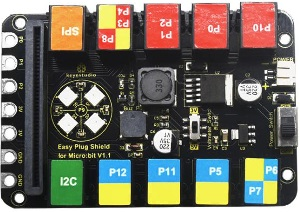

- Power supply: DC 6-10V  
- Output current: 1.5A  
- Interface: RJ11 6P6C interface and golden finger interface  
- Size: 98\*65\*17mm

**Interface Description：**

G：GND

V: Voltmeter_Switch control，dial to 5V end，5V；dial to 3V end, 3.3V 

**I2C Communication Port**

SDA：P20

SCL：P19

**SPI Communication Port**

MOSI：P15

MISO：P14

SCK：P13

#### 5. Wiring Up: 

Insert micro:bit onto EASY Plug shield, link white LED module with P5 port of shield and plug in power.

Note: Dial Voltmeter_Switch to 3V end.

#### 6. Test Code: 

You could navigate [https://makecode.micro:bit.org/reference](https://makecode.microbit.org/reference) to have access to more details.

Browse link [https://makecode.micro:bit.org/](https://makecode.microbit.org/) to edit your program. The following test code is as for your reference.

|  | “on start”: command block only runs once to start program. Turn off  dot matrix on micro:bit   The program under the block “forever” runs cyclically.  Set P5 to high level(1), turn on LED Delay in 1000ms  Set P5 to low level(0), turn off LED Delay in 1000ms |
| ----------------------------------------------- | ------------------------------------------------------------ |

#### 7. Test Results: 

Wire up, dial Voltmeter_Switch to 5V end, plug in external power and dial Power_Switch to ON end. Upload code to micro:bit and you will view LED flashing, with interval of 1s.

### Project 14: Breath

#### 1. Description: 

The light breath experiment is a little bit similar to the previous project. This time we connect the EASY Plug Red Led module to the EASY Plug Shield for micro bit V1.1. Connect the pin of LED module to P10 of micro:bit. From the Pinout diagram of micro:bit, you can get the P10 can be used as Analog IN.

This lesson you will learn how to control the brightness of LED on the module, gradually becoming brighter and dimming, just like the LED is breathing.

#### 2. What You Need: 

-   Micro:bit Board\*1

-   EASY Plug Shield for micro bit V1.1\*1

-   Micro USB Cable\*1

-   EASY Plug Red LED Module\*1

-   RJ11 Cable\*1

-   6-Slot AA Battery Holder\*1

-   1.5V AA Battery\*6

#### 3. Wiring Up: 

Insert micro:bit onto EASY Plug shield, connect red LED module to P10 of shield with a RJ11 cable, and plug in external power.

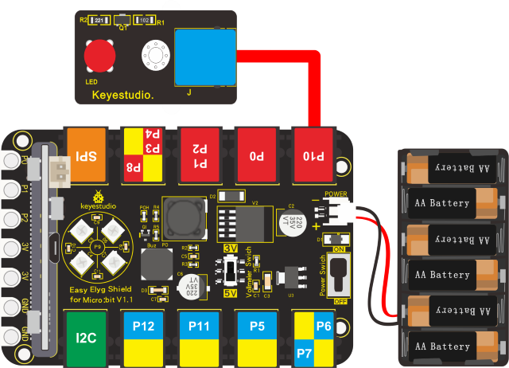

Note: Dial Voltmeter_Switch to 3V end

#### 4. Test Code: 

You could navigate [https://makecode.micro:bit.org/reference](https://makecode.microbit.org/reference) to have access to more details.

Browse link [https://makecode.micro:bit.org/](https://makecode.microbit.org/) to edit your program. The following test code is as for your reference.

|  | “on start”: command block only runs once to start program.  Turn off  dot matrix on micro:bit   The program under the block “forever” runs cyclically.  When val<1024, run the program in the do block Set val to val+1 Set analog value of P10 to val Delay in 5ms  When val>0, run the program in the do block Set val to val-1 Set the analog value of P10 to val. Delay in 5ms |
| ----------------------------------------------- | ------------------------------------------------------------ |

#### 5. Test Results: 

Wire up, dial Voltmeter_Switch to 3V end, plug in external power and dial Power_Switch to ON end and upload code to micro:bit.

You will find LED of module get brighter then darker, like human breath.

### Project 15: Blink and Breath

#### 1. Description: 

In this project, we will combine LED flash and breathing effect together.

#### 2. What You Need: 

-   Micro:bit Board\*1

-   EASY Plug Shield for micro bit V1.1\*1

-   Micro USB Cable\*1

-   EASY Plug Red LED Module\*1

-   RJ11 Cable\*1

-   6-Slot AA Battery Holder\*11.5V AA Battery\*6

#### 3. Wiring Up: 

Insert micro:bit onto EASY Plug shield，connect red LED module to P10 of shield with a RJ11 cable and connect external power.

Note: Dial Voltmeter_Switch to 3V end

#### 4. Test Code: 

You could navigate [https://makecode.micro:bit.org/reference](https://makecode.microbit.org/reference) to have access to more details.

Browse link [https://makecode.micro:bit.org/](https://makecode.microbit.org/) to edit your program. The following test code is as for your reference.

|  | “on start”: command block only runs once to start program.  Turn off  dot matrix on micro:bit   The program under the block “forever” runs cyclically.  Repeat the program in the do block twice  Set P10 to high level（1）, turn on LED Delay in 1000ms Set P10 to low level（0）, turn off LED  Delay in 1000ms  Repeat the program in the do block twice  When val<1024, run the program in the do block Set val to val+1 Set the analog value of P10 to val Delay in 5ms  When val>0, execute the program in the do block Set val to val-1 Set the analog value of P10 to val Delay in 5ms |
| ----------------------------------------------- | ------------------------------------------------------------ |

#### 5. Test Results: 

Wire up, dial Voltmeter_Switch to 3V end, plug in power and dial Power_Switch to ON end. Upload program to micro:bit, LED flashes twice and shows breathing effect twice ceaselessly.

### Project 16: RGB

#### 1. Description: 

EASY Plug shield comes with 2812 2x2 full color RGB, we will finish three
experiments with 2812 2x2 full color RGB.

In this project, we will demonstrate how to play music with passive buzzer. Easy
Plug shield comes with one. Let’s get started. (Passive buzzer is connected to
P9 on Easy Plug shield)

#### 2. What You Need: 

-   Micro:bit Board\*1

-   EASY Plug Shield for micro bit V1.1\*1

-   Micro USB Cable\*1

-   6-Slot AA Battery Holder\*1

-   1.5V AA Battery\*6

#### 3. 2812 2x2 full color RGB: 

2812 2x2 full color RGB module is a smart external control LED light source that integrates control circuit and lighting circuit. Each LED has the same appearance as a 5050 LED bead, and each component is a pixel point.

The pixel point includes an intelligent digital interface data latch signal shaping and amplifying driving circuit, as well as a high-precision internal oscillator and a 12V high-voltage programmable constant current control part, which effectively ensures that the color of the pixel point light is highly uniform.  

The data protocol adopts the single-line return-to-zero code communication mode. After power-on and reset the pixel point, the S pin receives the data transmitted from the controller. And the 24-bit data are extracted by the first pixel and then sent to the data latch inside the pixel point.

LED has advantages of low voltage drive, environmental protection and energy saving, high brightness, wide scattering angle, good consistency, ultra low power, long life and so on.

**Specification：**

- Working voltage: DC 5V

- Power: 0.1W

- Light source: SMD 5050 RGB

- IC model: 4pcs/WS2811

- Gray level: 256 levels

- Beam angle: 180°

- Luminous color: can be adjusted to white, red, yellow, blue, green, etc. by the controller

#### 4. Wiring Up: 

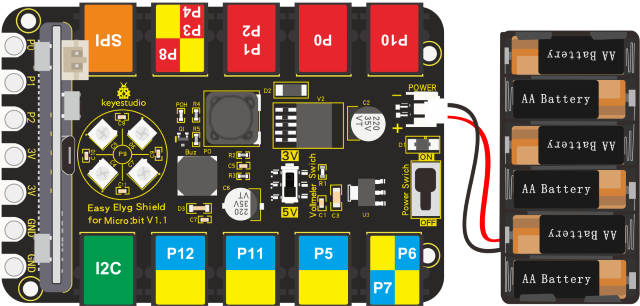

Note: Dial Voltmeter_Switch to 3V end

#### 5. Test Code: 

You could navigate [https://makecode.micro:bit.org/reference](https://makecode.microbit.org/reference) to have access to more details.

Browse link [https://makecode.micro:bit.org/](https://makecode.microbit.org/) to edit your program. The following test code is as for your reference.

We need to set test code in library file, and add the library of “neopixe”.

Click“Extensions”→“neopixel”，click to download

You will view library“neopixel”in the editing blocks, as shown below:

**Code 1:**

|  | “on start”:  command block only runs  once to start program.  Turn off dot matrix on micro:bit Set strip to NeoPixel at pin P9 with 4 leds as RGB Turn off 4 pcs WS2812 RGB lights   The program under “forever” runs cyclically.  make all RGB show red color Delay in 1000ms  make all RGB show orange color Delay in 1000ms  make all RGB show yellow color Delay in 1000ms  make all RGB show green color Delay in 1000ms  All of RGB show blue color Delay in 1000ms  make all RGB show indigo color Delay in 1000ms  make all RGB show violet color Delay in 1000ms  make all RGB show purple color Delay in 1000ms  make all RGB show white color Delay in 1000ms |
| ----------------------------------------------- | ------------------------------------------------------------ |

**Code 2**

|   |
| ------------------------------------------------------------ |
| “on start”: command block only runs once to start program. Turn off dot matrix on micro:bit Set strip to NeoPixel at pin P9 with 4 leds as RGB  The program under “forever” runs cyclically.  For index from 0 to 3, execute the program under do block Turn off 4 pcs WS2812 RGB lights Set pixel color of 4 pcs WS2812 RGB lights to red color Strip show Delay in 100ms  For index from 0 to 3, execute the program under do block Turn off 4 pcs WS2812 RGB lights Set pixel color of 4 pcs WS2812 RGB lights to orange color Strip show Delay in 100ms  For index from 0 to 3, execute the program under do block Turn off 4pcs WS2812 RGB lights Set pixel color of 4 pcs WS2812 RGB lights to yellow color Strip show Delay in 100ms  For index from 0 to 3, execute the program under do block Turn off 4pcs WS2812 RGB lights Set pixel color of 4 pcs WS2812 RGB lights to green color Strip show Delay in 100ms  For index from 0 to 3, execute the program under do block Turn off 4 pcs WS2812 RGB lights Set pixel color of 4 pcs WS2812 RGB lights to blue color Strip show Delay in 100ms  For index from 0 to 3, execute the program under do block Turn off 4 pcs WS2812 RGB  Set pixel color of 4 pcs WS2812 RGB lights to indigo color Strip show Delay in 100ms  For index from 0 to 3, execute the program under do block Turn off 4 pcs WS2812 RGB lights Set pixel color of 4 pcs WS2812 RGB lights to violet color Strip show Delay in 100ms  For index from 0 to 3, execute the program under do block Turn off 4 pcs WS2812 RGB Set pixel color of 4 pcs WS2812 RGB lights to violet color Strip refreshes to display Delay in 100ms  For index from 0 to 3, execute the program under do block Turn off 4 pcs WS2812 RGB Turn off 4 pcs Set pixel color of 4 pcs WS2812 RGB lights to white color Strip show Delay in 100ms |

**Code 3:**

|               |
| ------------------------------------------------------------ |
| “on start”: command block only runs once to start program. Turn off micro:bit LED dot matrix Set strip to NeoPixel at pin P9 with 4 leds as RGB Set strip to initialization o Set variable R, G, B to 0  The program under the block “forever” runs cyclically. When value of variable index is in 0-3, execute the program in the do block Set variable R, G, B to random number in 10~255 Turn off all RGB lights on the strip Set pixel color of 4 pcs WS2812 RGB lights to RGB Delay in 500ms strip refreshes to display |

#### 6. Test Results： 

Wiring up, dial Voltmeter_Switch to 3V end, plug in external power and dial Power_Switch to ON end.

Download code 1 to micro:bit, WS2812RGB lights display different color.

Download code 2 to micro:bit, WS2812RGB show same color like flow light.

Download code 3 to micro:bit, each WS2812RGB shows random color like flow light.

### Project 17: Play Music

#### 1. Description: 

In this project, we will demonstrate how to play music with passive buzzer. Easy Plug shield comes with one. Let’s get started. (Passive buzzer is connected to P0 on Easy Plug shield)

#### 2. What You Need: 

-   Micro:bit Board\*1

-   EASY Plug Shield for micro bit V1.1\*1

-   Micro USB Cable\*1

-   Slot AA Battery Holder\*1

-   1.5V AA Battery\*6

#### 3. Passive Buzzer Module: 

The buzzer includes active buzzer and passive buzzer. The difference between them a built-in vibration source, therefore, it will make a sound when power is plugged in.

We need 2K-5K square wave to drive passive buzzer because the buzzer on EASY Plug Shield doesn’t come with this kind of source.

Different frequencies produce different sounds. You can use the micro:bit to compose a simple, interesting and melodic song.

**Specification：**

- Working voltage: 3.3-5V

- Interface type: Digital

#### 4. Wiring Up: 

Note: Dial Voltmeter_Switch to 3V end.

#### 5. Test Code: 

You could navigate [https://makecode.micro:bit.org/reference](https://makecode.microbit.org/reference) to have access to more details.

Browse link [https://makecode.micro:bit.org/](https://makecode.microbit.org/) to edit your program. The following test code is as for your reference.

**Code 1:**

|  | “on start”:  command block only runs once to start program.  Turn off  dot matrix on micro:bit   The program under the block “forever” runs cyclically.  When i<80, run the program in the block Set P0 to low level(0) to make passive buzzer silent Delay in 1ms Set P0 to high level(1) to make passive buzzer emit sound Delay in 1ms Set variable i to i+1  Set variable i to 0 Delay in 100ms  When i<100, run the program in the do block  Set P0 to high level(1) to make passive buzzer emit sound Delay in 2ms Set P0 to low level(0) to make passive buzzer silent Delay in 2ms Set variable i to i+1 |
| ----------------------------------------------- | ------------------------------------------------------------ |

**Code 2:**

Note: Click to switch into
JavaScript code, each frequency and beat of tone is shown below:

#### 6. Test Results: 

Wiring up, dial Voltmeter_Switch to 3V end, plug in external power and dial Power_Switch to ON end and upload code 1 to micro:bit, you will hear the buzzer emit two kind of sounds; if download code 2 to micro:bit, the song “Ode to Joy” will be played.

### Project 18: Knock Sensor

#### 1. Description: 

Sensor can detect the data, sense the signal and control the devices. We are familiar with light sensor, temperature, humidity and sound sensors. A great deal of experiments could be finished with these sensors and modules.

We will control the LED by knock sensor in the experiment.

#### 2. What You Need: 

-   Micro:bit Board\*1

-   EASY Plug Shield for micro bit V1.1\*1

-   Micro USB Cable\*1

-   EASY Plug Knock Sensor\*1

-   EASY Plug Red LED Module\*1

-   RJ11 Cable\*2

-   6-Slot AA Battery Holder\*1

-   1.5V AA Battery\*6

#### 3. EASY Plug Knock Sensor: 

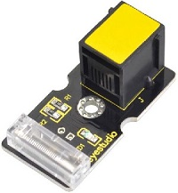

The knock sensor is mainly composed of SW-280 vibration switch, which is an inductive proximity switch.   

It is an electronic switch that transmits the sensing result to the circuit device and induces the circuit to start working when the vibration force is induced.   

The module comes with a positioning hole for you to fix it to other devices.  

You can make full use of it with creative thinking, like electronic drum, and so on.   

This module should be used together with EASY plug control board.

**Specification:**
- Interface: Digital 
- Working voltage: 5V 

- Sensor type: Easy plug

#### 4. Wiring Up: 

Insert micro:bit onto EASY Plug shield, connect knock sensor and red LED module to P1 and P5 port of shield with two RJ11 cables.

Note: Dial Voltmeter_Switch to 3V end.

#### 5. Test Code: 

You could navigate [https://makecode.micro:bit.org/reference](https://makecode.microbit.org/reference) to have access to more details.

Browse link [https://makecode.micro:bit.org/](https://makecode.microbit.org/) to edit your program. The following test code is as for your reference.

|  | “on start”: command block only runs once to start program. Turn off dot matrix on micro:bit  The program under the block “forever” runs cyclically.  If it is true, execute the program under do block  If the digital signal of P1 is 0,  module is knocked,  execute the program under then block Set P5 to high level(1), turn on LED Delay in 1000ms  If the digital signal of P1 is 1,  module is not knocked,  execute the program under else block Set P5 to low level(0) to turn off LED |
| ----------------------------------------------- | ------------------------------------------------------------ |

#### 6. Test Results: 

Wiring up, dial Voltmeter_Switch to 3V end, plug in external power and dial Power_Switch to ON end and upload code to micro:bit.

When the module is knocked, LED turns on for 1s; if not, LED is off.

### Project 19:Someone Comes

#### 1. Description: 

In this experiment, we connect EASY Plug PIR motion sensor to micro:bit and detect the object moving , the detected digital signals will be displayed on serial monitor.

#### 2. What You Need: 

-   Micro:bit Board\*1

-   EASY Plug Shield for micro bit V1.1\*1

-   Micro USB Cable\*1

-   EASY Plug PIR Motion Sensor\*1

-   EASY Plug Red LED Module\*1

-   RJ11 Cable\*2

-   6-Slot AA Battery Holder\*1

-   1.5V AA Battery\*6

#### 3. EASY Plug PIR Motion Sensor: 

PIR stands for Pyroelectric Infrared (many times, they are also referred as Passive Infrared sensors). This is because their principle of operation is based on the detection of infrared energy emitted by a moving body. The PIR sensor can detect infrared signals from a moving person or moving animal, outputting switching signals. 

One important thing to mention is that when motion is detected, the output will stay high for 2.3 to 3 seconds after the motion stops. Regarding the power supply, it can work with voltages of both 3.3V and 5V. The device has a detection range of 7 meters and a detection angle of 100º.

**Specification:**

-   Connector: Easy plug

-   Input Voltage: 3.3 \~ 5V, Maximum 6V

-   Working Current: 15uA

-   Working Temperature: -20 \~ 85℃

-   Output Voltage: High 3V, Low 0V

-   Output Delay Time (High Level): about 2.3 to 3 Seconds

-   Detection angle: 100°

-   Detection distance: 7 meters

-   Output Indicator LED (When output HIGH, it will be ON)

-   Pin limit current: 100mA

#### 4. Wiring Up: 

Insert micro:bit onto EASY Plug shield, connect PIR motion sensor and red LED to P1 and P5 port of shield.

Note: Dial Voltmeter_Switch to 3V end.

#### 5. Test Code: 

You could navigate [https://makecode.micro:bit.org/reference](https://makecode.microbit.org/reference) to have access to more details.

Browse link [https://makecode.micro:bit.org/](https://makecode.microbit.org/) to edit your program. The following test code is as for your reference.

|  | “on start”: command block only runs once to start program. Clear LED dot matrix Set P0 to low level(0), turn off passive buzzer  The program under the block“forever”runs cyclically.  Micro:bit shows the digital signal read by PIR motion sensor.  If digital signal read by P1, detect people’s motion,  execute the program under then block. Set P5 to high level(1), LED turns on Delay in 200ms Set P5 to low level(0), LED is off Delay in 200ms Play tone C for 1 beat, passive buzzer emits sound.  When digital signal read by P1 is 0, nobody is detected,  execute the program under else block Set P0 to low level(0), passive buzzer doesn’t sound Set P5 to low level(0), LED is off |
| ----------------------------------------------- | ------------------------------------------------------------ |

#### 6. Test Results: 

Wiring up, dial Voltmeter_Switch to 3V end, plug in external power and dial Power_Switch to ON end and upload code to micro:bit. 

When PIR motion sensor detects the movement of PIR motion sensor. LED flashes, passive buzzer emits sound and micro:bit shows high level(1); by contrast, micro:bit shows low level(0), LED is off and buzzer doesn’t emit sound.

### Project 20: Capacitive Touch

#### 1. Description: 

Are you tired of mechanical buttons? Try the capacitive touch module. 

In this lesson, we will replace button switch with capacitive touch module and demonstrate how to control passive buzzer with capacitive buzzer.

#### 2. What You Need: 

-   Micro:bit Board\*1

-   EASY Plug Shield for micro bit V1.1\*1

-   Micro USB Cable\*1

-   EASY Plug Capacitive Touch Module \*1

-   RJ11 Cable\*1

-   6-Slot AA Battery Holder\*1

-   1.5V AA Battery\*6

#### 3. EASY Plug Capacitive Touch Module: 

Based on touch detection chip, the touch area of capacitive touch module is applied widely on a plenty of touch sensors. This touch sensor features the one-key button function and adopts the most popular capacitive sensing technology. In addition, it can "feel" people and metal touch and feedback a high/low voltage level. Even isolated by some cloth and paper, it can still feel the touch. The sensitivity will decrease as the isolation getting thick.

This sensor can tackle the traditional button problems, with the characteristics of low consumption and wide working voltage.

**Specification:**

-   Jog type: the initial state is low, high touch, do not touch is low (similar touch of a button feature);
    
-   Low power consumption;

-   Power supply for 3.3 \~ 5V DC;

-   Smooth touch surface

#### 4. Wiring Up: 

Insert micro:bit onto EASY Plug shield, connect capacitive touch module to P1 port of shield.

Note: Dial Voltmeter_Switch to 3V end.

#### 5. Test Code: 

You could navigate [https://makecode.micro:bit.org/reference](https://makecode.microbit.org/reference) to have access to more details.

Browse link [https://makecode.micro:bit.org/](https://makecode.microbit.org/) to edit your program. The following test code is as for your reference.

|  | “on start”: command block only runs once to start program. Turn off  dot matrix on micro:bit Set P0 to low level(0), turn off passive buzzer   The program under the block“forever”runs cyclically.  Serial writes the digital signals read by sensor  If the digital signal read by P1 is 1,  touch sensor, execute the program under then block Play tone C for 1 beat, make passive buzzer emit sound  If the digital signal read by P1 is 0,  sensor is not touched, execute the program under else block Set P0 to low level (0), turn off passive |
| ----------------------------------------------- | ------------------------------------------------------------ |

#### 6. Test Results: 

Wiring up, dial Voltmeter_Switch to 3V end, plug in external power and dial Power_Switch to ON end and upload code to micro:bit.

Open CoolTerm, click Options and select SerialPort, set COM port and baud rate, set baud rate to 115200. Tap OK and Connect.

When touch area is touched, CoolTerm monitor shows 1 and passive buzzer emits sound; otherwise, 0 is shown on CoolTerm monitor and passive buzzer doesn’t emit sound, as shown below:

### Project 21: Obstacle Avoidance

#### 1. Description: 

Have you ever seen a smart car avoid the obstacle itself?

Do you know why? Let me explain to you in this chapter.

We will use a passive buzzer, red LED module and an obstacle avoidance sensor in the experiment.

#### 2. What You Need: 

-   Micro:bit Board\*1

-   EASY Plug Shield for micro bit V1.1\*1

-   Micro USB Cable\*1

-   EASY Plug Obstacle Avoidance Sensor\*1

-   EASY Plug Red LED Module\*1

-   RJ11 Cable\*2

-   6-Slot AA Battery Holder\*1

-   1.5V AA Battery\*6

#### 3. Obstacle Avoidance Sensor: 

Infrared obstacle avoidance sensor is equipped with distance adjustment function and is especially designed for wheeled robots.  

This sensor has strong adaptability to ambient light and is of high precision. It has a pair of infrared transmitting and receiving tube.   

When the infrared ray launched by the transmitting tube encounters an obstacle (its reflector), the infrared ray is reflected to the receiving tube, after a comparator circuit processing, the indicator will light up.   

You can adjust the detection distance by rotating the potentiometer knob, the effective distance range of 2\~40cm.   

They can be widely used in robot obstacle avoidance, avoidance car, line count, and black and white line tracking and many other occasions.

**Specification:**

- Working voltage: DC 3.3V-5V

- Working current: ≥20mA

- Working temperature: -10℃ to＋50℃

- IO interface: EASY Plug(G(-)/V(+)/out/EN)

- Signal output: TTL voltage

- Detection distance: 2-40cm

#### 4. Wiring Up: 

Insert micro:bit onto slot of EASY Plug shield, connect obstacle avoidance sensor and red LED module to P1 and P5 of Easy Plug shield.

Note: Dial Voltmeter_Switch to 3V end.

#### 5.Test Code: 

You could navigate [https://makecode.micro:bit.org/reference](https://makecode.microbit.org/reference) to have access to more details.

Browse link [https://makecode.micro:bit.org/](https://makecode.microbit.org/) to edit your program. The following test code is as for your reference.

|  | “on start”: command block only runs once to start program. Turn off  dot matrix on micro:bit Set P0 to low level(0), turn off passive buzzer  The program under the block“forever”runs cyclically.  Serial writes the digital signal read by obstacle avoidance sensor  If the digital signal=0, detect the obstacle,  execute the program under then block Play tone C for 1 beat to make passive buzzer emit sound Set P5 to high level(1), turn on LED delay in 100ms Set P5 to low level(0), turn off LED delay in 100ms  If the digital signal=1, detect no obstacle,  execute the program under else block Set P0 to low level(0), passive buzzer doesn’t emit sound Set P5 to low level(0), turn off LED |
| ----------------------------------------------- | ------------------------------------------------------------ |

#### 6. Test Results: 

Wiring up, dial Voltmeter_Switch to 3V end, plug in external power and dial Power_Switch to ON end and upload code to micro:bit.

Open CoolTerm, click Options and select SerialPort, set COM port and baud rate, set baud rate to 115200. Tap OK and Connect.

When the obstacle is detected, CoolTerm monitor shows 0 and passive buzzer emits sound and LED flashes ceaselessly; by contrast, CoolTerm monitor displays 1, LED is off, nor the passive buzzer does emit sound.

### Project 22: Servo

#### 1. Description: 

In this chapter, we will illustrate the principle and application of servo.

#### 2. What You Need: 

-   Micro:bit Board\*1

-   EASY Plug Shield for micro bit V1.1\*1

-   Micro USB Cable\*1

-   EASY Plug Servo Module\*1

-   Keyestudio Servo\*1

-   RJ11 Cable\*1

-   6-Slot AA Battery Holder\*1

-   1.5V AA Battery\*6

#### 3. EASY Plug Servo Module: 

****

If you want to use the Micro Servo and EASY PLUG control board to do some experiments, you need to use the EASY Plug Servo extension module.

The EASY Plug Servo module is extended into Registered Jack, so you can connect it to EASY PLUG control board using only a RJ11 cable.

The Servo module also comes with 3pins of 2.54mm pin pitch, fully compatible with servo pins.

#### 4. Servo: 

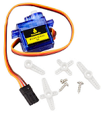

Servo motor comes with many specifications. But all of them have three connection wires, distinguished by brown, red, orange colors. Brown one is for ground, red one for power positive, orange one for signal line.

Included with your Micro Servo you will find a variety of white motor mounts that connect to the shaft of your servo.

You may choose to attach any mount you wish for the circuit. It will serve as a visual aid, making it easier to see the servo spin.

The rotation angle of servo is controlled by regulating the duty cycle of the PWM(Pulse-Width Modulation) signal.

The standard cycle of the PWM signal is fixed at 20ms (50 Hz), and the pulse width is distributed between 1ms-2ms.

The pulse width corresponds to the rotation angle ( 0°～90°) of servo.

**Specification:**

-   Operating voltage: DC 4.8V〜6V

-   Angle range: about 180°(in 500→2500μsec)

-   Pulsewidth range: 500→2500μsec

-   No-load speed: 0.12±0.01 sec/60（DC 4.8V）; 0.1±0.01 sec/60（DC 6V）

-   No-load current: 200±20mA（DC 4.8V）; 220±20mA（DC 6V）

-   Stop torque: 1.3±0.01kg/cm（DC 4.8V）; 1.5±0.1kg/cm（DC 6V）

-   Stop current: ≦850mA（DC 4.8V）; ≦1000mA（DC 6V）

-   Standby current: 3±1mA（DC 4.8V）; 4±1mA（DC 6V）

-   Operation temperature: -10℃〜50℃

-   Save temperature: -20℃〜60℃

-   Motor wire length: 250 ± 5 mm

-   Dimensions: 22.9mm\*12.2mm\*30mm

-   Weight: 9± 1 g (without servo mounts)

#### 5. Wiring Up: 

Insert micro:bit onto EASY Plug shield, link servo with servo module. Brown line is connected to G, red line is linked with V and orange line is connected to S. Connect servo module to P1 port of shield.

Note:Dial Voltmeter_Switch to 5V end.

#### 6. Test Code: 

You could navigate [https://makecode.micro:bit.org/reference](https://makecode.microbit.org/reference) to have access to more details.

Browse link [https://makecode.micro:bit.org/](https://makecode.microbit.org/) to edit your program. The following test code is as for your reference.

|  | “on start”: command block only runs once to start program. Turn off  dot matrix on micro:bit Rotate P1 to 0° Delay in 100ms  The program under “forever” runs cyclically. Rotate P1 to 0° Delay in 1000ms Rotate P1 to 180° Delay in 1000ms |
| ----------------------------------------------- | ------------------------------------------------------------ |

#### 7. Test Results: 

Wiring up, dial Voltmeter_Switch to 5V end, plug in external power and dial Power_Switch to ON end and upload code to micro:bit.

You will view the servo rotate from 0 ° to 180 °

### Project 23: Fan Module

#### 1. Description: 

We will make fan module turn clockwise, anticlockwise and stop.

#### 2. What You Need: 

-   Micro:bit Board\*1

-   EASY Plug Shield for micro bit V1.1\*1

-   Micro USB Cable\*1

-   EASY PlugL9110 Fan Module \* 1

-   RJ11 Cable\*1

-   6-Slot AA Battery Holder\*1

-   1.5V AA Battery\*6

#### 3. EASY Plug Fan Module: 

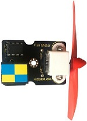

EASY PlugL9110 fan module cooperates GND, VCC, INA and INB pin. Pin INA and INB can control the speed and direction of fan.

This fan control module adopts L9110 motor control chip. It can control the rotation direction of the motor, hence the fan. The module is designed with mounting hole, compatible with servo motor control.   

The module is of high efficiency, with the high quality fan, it can easily blow out flame of a light in 20cm distance.

It is widely applied in air propeller, cooling system and spinning frame.

**Specification:**

-   Fan blade diameter: 75mm 

-   Interface type: dual analog I/O port interface

-   Working voltage: 5V

#### 4. Wiring Up: 

Insert micro:bit onto EASY Plug shield, connect fan module to P1-P2 port of shield.

Note: dial Voltmeter_Switch to 5V end.

#### 5. Test Code: 

You could navigate [https://makecode.micro:bit.org/reference](https://makecode.microbit.org/reference) to have access to more details.

Browse link [https://makecode.micro:bit.org/](https://makecode.microbit.org/) to edit your program. The following test code is as for your reference.

|   | “on start”: command block only runs once to start program. Turn off  dot matrix on micro:bit   Set subfucntion foreward speed1 Set P1 to low level(0) Set the analog value of P2 to speed 1   Set subfucntion reversal speed 2 Set P2 to low level(0) Set analog value of P1 to speed 2   Subfunction stop Set P1 and P2 to low level(0)   The program under “forever” runs cyclically.  Call subfunction foreward, set speed to 800 Delay in 1000ms Call subfunction stop, stop Delay in 2000ms Call subfunction reversal, set speed to 500 Delay in 1000ms Set subfunction stop,  stop Call the sub Delay in 2000ms |
| ------------------------------------------------------------ | ------------------------------------------------------------ |

#### 6. Test Results: 

Wiring up, dial Voltmeter_Switch to 5V end, plug in external power and dial Power_Switch to ON end and upload code to micro:bit.

You will view that fan module rotate clockwise for 1s, and stop for 2s, then anticlockwise for 1s, and stop for 2s.

### Project 24: Fire Alarm

#### 1. Description: 

The violent fire will cause huge economic and human loss if without any effective measures.

You only need a flame sensor that can alarm if sensing the fire.

In this program, we will imitate the fire alarm system with flame sensor, passive buzzer and red LED module.

#### 2. What You Need: 

-   Micro:bit Board\*1

-   EASY Plug Shield for micro bit V1.1\*1

-   Micro USB Cable\*1

-   EASY Plug Flame Sensor\*1

-   EASY Plug Red LED Module\*1

-   RJ11 Cable\*2

-   6-Slot AA Battery Holder\*1

-   1.5V AA Battery\*6

#### 3. EASY Plug Flame Sensor: 

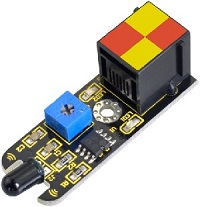

The flame sensor can be used to detect fire or other wavelength at 760nm~1100nm light.   

In the fire-fighting robot game, the flame plays an important role in the probe, which can be used as the robot's eyes to find fire source. The potentiometer on the flame sensor can be used to adjust the sensitivity.

**Specification:**

- Working voltage: 3.3V to 5V 
- Detection angle: about 60° 

- Detection range: 20cm (4.8V) \~ 100cm (1V) 

- Spectral bandwidth: 760nm to 1100nm 

- Working temperature: -25℃ to 85℃ 

- Sensor type: Easy plug
- Interface: digital

#### 4. Wiring Up: 

Insert micro:bit onto Easy Plug shield , connect flame sensor and red LED module to P1 and P5 port of shield with RJ11 cables.

Note: Dial Voltmeter_Switch to 3V end.

#### 5. Test Code: 

You could navigate [https://makecode.micro:bit.org/reference](https://makecode.microbit.org/reference) to have access to more details.

Browse link [https://makecode.micro:bit.org/](https://makecode.microbit.org/) to edit your program. The following test code is as for your reference.

|  | “on start”: command block only runs once to start program. Turn off dot matrix Set P0 to low level(0), turn off passive buzzer  The program under the block“forever”runs cyclically.  Micro:bit shows digital signals  If the digital signal is 0, there is flame,  execute the program under then block Play tone C for 1 beat, passive buzzer emits sound Set P5 to high level(1), turn on LED  If the digital signal is 1, there is no flame,  execute the program under else block Set P5 to low level(0), turn off passive buzzer Set P0 to low level(0), turn off passive buzzer |
| ----------------------------------------------- | ------------------------------------------------------------ |

#### 6. Test Results: 

Wiring up, dial Voltmeter_Switch to 3V end, plug in external power and dial Power_Switch to ON end and upload code to micro:bit show 0 (low level), LED is on and passive buzzer emits sound; by contrast.

1 appears on micro:bit, LED is off and buzzer doesn’t emit sound.

### Project 25: Flammable Gas in the Air

#### 1. Description: 

This gas sensor is used in gas leakage detecting equipment in consumer electronics and industrial markets.  

This sensor is suitable for detecting LPG, I-butane, propane, methane, alcohol, Hydrogen and smoke. It has high sensitivity and quick response. We will show you how to detect the flammable gas in the air with gas sensor.

#### 2. What You Need: 

-   Micro:bit Board\*1

-   EASY Plug Shield for micro bit V1.1\*1

-   Micro USB Cable\*1

-   EASY Plug Analog Gas Sensor\*1

-   EASY Plug Red LED Module\*1

-   RJ11 Cable\*2

-   6-Slot AA Battery Holder\*1

-   1.5V AA Battery\*6

#### 3. EASY Plug Analog Gas Sensor: 

This is a robust Gas sensor suitable for sensing **LPG**, **Smoke**, **Alcohol**, **Propane**, **Hydrogen**, **Methane** and **Carbon Monoxide** concentrations in the air. If you are planning on creating an indoor air quality monitoring system; breath checker or early fire detection system, Easy Plug gas Sensor Module is a great choice.

It has two signal terminals-pin A0 and D0. The value of A0 will rise up as the concentration of flammable gas.

**Specification:**

-   Port: Easy plug

-   Working Voltage: 5V

-   Interface Type: Digital and Analog

-   Wide detecting scope

-   Simple drive circuit

-   Stable and long lifespan

-   Quick response and High sensitivity

#### 4. Wiring Up: 

Insert micro:bit onto EASY Plug shield, connect analog gas sensor and red LED module to P4 and P5 port of shield with RJ11 cables.

Note: dial Voltmeter_Switch to 5V end.

#### 5. Test Code: 

You could navigate [https://makecode.micro:bit.org/reference](https://makecode.microbit.org/reference) to have access to more details.

Browse link [https://makecode.micro:bit.org/](https://makecode.microbit.org/) to edit your program. The following test code is as for your reference.

（Note：the gas analog value could be adjusted）

|  | “on start”:  command block only runs once to start program.  Turn off  dot matrix on micro:bit Set P0 to low level(0), turn off passive buzzer   The program under the block“forever”runs cyclically.  Serial writes analog signals read by analog gas sensor  If the analog signal read by P4 is greater than 600, execute the program under then block Play C tone for 1 beat, passive buzzer emits sound Set P5 to high level(0), turn on LED  If the analog signals read by P4 is less than and equivalent to 600,  execute the program under else block Set P5 to low level(0), turn off LED Set P0 to low level(0), turn off passive buzzer |
| ----------------------------------------------- | ------------------------------------------------------------ |

#### 6. Test Results: 

Wiring up, dial Voltmeter_Switch to 5V end, plug in external power and dial Power_Switch to ON end and upload code to micro:bit.

LED2 on gas sensor will be on, you could adjust the sensitivity(make LED at on-and-off state) with blue potentiometer.

Open CoolTerm, click Options and select SerialPort, set COM port and baud rate, set baud rate to 115200. Tap OK and Connect.

Putt the firelighter close to analog gas sensor, the analog value on CoolTerm monitor will get larger and LED1 will be on. When sensor detects the analog value more than 600, buzzer will emit sound; otherwise, buzzer is silent and LED is off.

## Project 26: Ambient Light

#### 1. Description: 

In this project, we will detect the ambient brightness with EASY PlugTEMT6000 light sensor.

#### 2. What You Need: 

-   Micro:bit Board\*1

-   EASY PlugShield for micro bit V1.1\*1

-   Micro USB Cable\*1

-   EASY Plug TEMT6000 Ambient Light Sensor\*1

-   RJ11 Cable\*1

-   6-Slot AA Battery Holder\*1

-   1.5V AA Battery\*6

#### 3. EASY Plug TEMT6000: 

**Ambient Light Sensor:**

The TEMT6000 was designed as an ambient light detector for automatically controlling the backlight dimming of cell phones, laptops, car dashboards and similar items. It can be used in many applications where it is desirable to measure the relative brightness of the light falling on the sensor.

The sensor is designed to mainly detect the light spectrum visible to the human eye with peak sensitivity at 570nm which is in the green spectrum. The full range spans 440nm to 800nm.  
It does react well to very small changes in a wide range of brightness, however, it does not react well to IR or UV light. The sensor can help you to to detect the light density.

**Specification:**

-   Working voltage: DC +5v

-   Communication interface: analog voltage

-   Only sensitive to visible light, no need for additional filters

-   Recognizable light intensity range: 1 – 1000 Lux

-   Good linear output

#### 4. Wiring Up: 

Insert micro:bit onto EASY Plug shield, connect EASY Plug TEMT6000 ambient sensor to P1 port of shield with a RJ11 cable.

Note: Dial Voltmeter_Switch to 5V end.

#### 5. Test Code: 

You could navigate [https://makecode.micro:bit.org/reference](https://makecode.microbit.org/reference) to have access to more details.

Browse link [https://makecode.micro:bit.org/](https://makecode.microbit.org/) to edit your program. The following test code is as for your reference.

|  | “on start”: command block only runs once to start program. Turn off  dot matrix on micro:bit  The program under the block “forever” runs cyclically. Serial writes analog signals read by alcohol sensor Delay in 100ms |
| ----------------------------------------------- | ------------------------------------------------------------ |

#### 6. Test Results: 

Wiring up, dial Voltmeter_Switch to 5V end, plug in external power and dial Power_Switch to ON end and upload code to micro:bit.(LED2 of sensor shows green color, and you could adjust potentiometer to keep LED on module in off-and-on state(the sensitivity is highest)

Open CoolTerm, click Options and select SerialPort, set COM port and baud rate, set baud rate to 115200. Tap OK and Connect.

The stronger the light is , the larger the analog value is; by contrast, the smaller the analog value is, as shown below:

### Project 27: Slide Position

#### 1. Description: 

You will learn how to use slide potentiometer to control LED and servo.

#### 2. What You Need: 

-   Micro:bit Board\*1

-   EASY Plug Shield for micro bit V1.1\*1

-   Micro USB Cable\*1

-   EASY Plug Slide Potentiometer\*1

-   EASY Plug Red LED Module\*1

-   EASY Plug Servo\*1

-   Keyestudio Servo\*1

-   RJ11 Cable\*3

-   6-Slot AA Battery Holder\*1

-   1.5V AA Battery\*6

#### 3. EASY Plug Slide Potentiometer: 

The EASY plug slide potentiometer uses high-quality sliding appliances for stable and reliable performance. It is a dual analog output that outputs a 0-VCC analog voltage signal. 

The module pins are extended into Registered jack, so you can easily connect it to EASY Plug control board using a RJ11 cable. There are 6 pad interfaces on the module. So you can solder two 3pin headers with a pitch of 2.54mm on the module.   

It can be used to connect with other MCUs. The signal terminal outputs two analog values. The sum of the two analog values is 1023.

**Specification:**

-   Working voltage: DC 3.3V-5V

-   Resistance: 10KΩ

-   Interface: analog interface

-   Attribute: ROHS

#### 4. Wiring Up:

Insert micro:bit onto EASY Plug shield, connect slide potentiometer, red LED module and servo module to P3-P4, P1 and P10 port of shield with RJ11 cables.

The brown line, red line and orange line of servo are respectively connected to G, V and S.

Note: Dial Voltmeter_Switch to 5V end.

#### 5. Test Code: 

You could navigate [https://makecode.micro:bit.org/reference](https://makecode.microbit.org/reference) to have access to more details.

Browse link [https://makecode.micro:bit.org/](https://makecode.microbit.org/) to edit your program. The following test code is as for your reference.

#### 6.Test Results: 

Wiring up, dial Voltmeter_Switch to 5V end, plug in external power and dial Power_Switch to ON end and upload code to micro:bit.

Open CoolTerm, click Options and select SerialPort, set COM port and baud rate, set baud rate to 115200. Tap OK and Connect.

CoolTerm monitor displays analog value of pin P3 and P4, if slide the potentiometer, value will alter in 0-1023, and servo will rotate in the range of 0°-180°, as shown below:

### Project 28: Light Brightness

#### 1. Description: 

Sensors are everywhere in our life, street lights will turn on at night but off at day, why? In fact, it is because the photosensitive element that can sense the ambient light brightness. In this program, we will control the light brightness by photoresistor module.

#### 2. What You Need: 

-   Micro:bit Board\*1

-   EASY Plug Shield for micro bit V1.1\*1

-   Micro USB Cable\*1

-   EASY Plug Photoresistor\*1

-   EASY Plug Red LED Module\*1

-   RJ11 Cable\*2

-   6-Slot AA Battery Holder\*1

-   1.5V AA Battery\*6

#### 3. EASY Plug Photoresistor:

A photoresistor or light-dependent resistor (LDR) or photocell is a light-controlled variable resistor. The principal is very simple. The resistance of photoresistor varies with incident light intensity. If the incident light intensity is high, the resistance decreases; if the light intensity is low, the resistance increases.

keyestudio EASY Plug photocell sensor is a semiconductor, integrated with a photoresistor, easy to use and very convenient for wiring. 

It has features of high sensitivity, quick response, spectral characteristic and R-value consistence.

It can be applied in light-sensitive detector circuits, intelligent switch design and light- and dark-activated switching circuits.

#### 4. Wiring Up: 

Insert micro:bit onto EASY Plug shield, connect photoresistor and red LED module to P1 and P10 port of shield with RJ11 cables.

Note:  Dial Voltmeter_Switch to 3V end.

#### 5. Test Code: 

You could navigate [https://makecode.micro:bit.org/reference](https://makecode.microbit.org/reference) to have access to more details.

Browse link [https://makecode.micro:bit.org/](https://makecode.microbit.org/) to edit your program. The following test code is as for your reference.

|  | “on start”:  command block only runs once to start program. Turn off  dot matrix on micro:bit  The program under the block “forever” runs cyclically.  Serial writes the analog signals detected by photoresistor Delay in 100ms Set the detected analog signal(0-1023) by photoresistor  and map the analog value of LED connected P10. |
| ----------------------------------------------- | ------------------------------------------------------------ |

#### 6. Test Results: 

Wiring up, dial Voltmeter_Switch to 3V end, plug in external power and dial Power_Switch to ON end and upload code to micro:bit.

Open CoolTerm, click Options and select SerialPort, set COM port and baud rate, set baud rate to 115200. Tap OK and Connect.

As the ambient light brightness increases, so does the analog value on CoolTerm monitor, red LED gradually gets brighter; by contrast, analog value reduces and LED gets dimmer.

### Project 29: OLED Display

#### 1. Description: 

OLED module is applied widely in mobile devices, in this project, we will demonstrate how to display numbers, context and pictures with OLED module.

#### 2. What You Need: 

-   Micro:bit Board\*1

-   EASY Plug Shield for micro bit V1.1\*1

-   Micro USB Cable\*1

-   EASY Plug OLED Module\*1

-   RJ11 Cable\*1

-   6-Slot AA Battery Holder\*1

-   1.5V AA Battery\*6

#### 3. EASY Plug OLED Module: 

OLED is short for organic light emitting diode. On the microscopic level, an OLED display is a matrix of organic LEDs that light up when they emit energy. 

Our EASY Plug OLED displays are perfect when you need a small display with vivid, high-contrast color. 

The visible portion of the OLED measures 0.96" diagonal and contains 128 x 64 pixels. 

An OLED display works without a backlight. Thus, it can display deep black levels and can be thinner and lighter than a liquid crystal display (LCD). 

In low ambient light conditions such as a dark room an OLED screen can achieve a higher contrast ratio than an LCD. 

OLED technology is used in commercial applications such as displays for mobile phones and portable digital media players, car radios and digital cameras among others.

**Specification:**

-   0.96" diagonal OLED

-   Pixels: 128 × 64

-   Color Depth: Monochrome (White)

-   5V power

-   Brightness (cd/m2): 100 (Typ)

#### 4. Wiring Up: 

Insert micro:bit onto EASY Plug shield, connect OLED module to I2C port of shield with a RJ11cable.

Note: Dial Voltmeter_Switch to 5V end.

#### 5. Test Code: 

You could navigate [https://makecode.micro:bit.org/reference](https://makecode.microbit.org/reference) to have access to more details.

Browse link [https://makecode.micro:bit.org/](https://makecode.microbit.org/) to edit your program. The following test code is as for your reference.

Next, we need to add the library file of OLED module:

Search “OLED”, as shown below, select the first “oled -ssd1306” library file, and install library.

After the installation, the library of OLED module will be displayed in the listed blocks on Makecode editor.

**Complete Code:**

|  | “on start”: command block only runs once to start program.  Turn off  dot matrix on micro:bit  OLED initializes, 128 in width, 64 in height   The program under “forever” runs cyclically.  Repeat 4 times  OLED shows character string “ABCDEFGHIJK” Delay in 500ms OLED shows character string “LMNOPQRST” Delay in 500ms OLED displays “123456789” Delay in 500ms OLED shows “10111213” Delay in 500ms  Clear OLED display  Draw rectangular from x:90 y:90 to x:20 y:20  Clear OLED display |
| ----------------------------------------------- | ------------------------------------------------------------ |

#### 6. Test Results: 

Wiring up, dial Voltmeter_Switch to 5V end, plug in external power and dial Power_Switch to ON end and upload code to micro:bit.

OLED display will show the corresponding characters and pictures.

### Project 30: Water Your Plant

#### 1. Description: 

This is a simple soil humidity sensor aims to detect the soil humidity. 

If the soil is in lack of water, the analog value output by the sensor will decrease; otherwise, it will increase. If you use this sensor to make an automatic watering device, it can detect whether your botany is thirsty to prevent it from withering when you go out.

#### 2. What You Need: 

-   Micro:bit Board\*1

-   EASY Plug Shield for micro bit V1.1\*1

-   Micro USB Cable\*1

-   EASY Plug Soil Humidity Sensor\*1

-   EASY Plug OLED Module\*1

-   RJ11 Cable\*2

-   Slot AA Battery Holder\*11.5V AA Battery\*6

#### 3. EASY Plug Soil Humidity Sensor: 

The EASY Plug soil moisture sensor can read the amount of moisture present in the soil surrounding it. It's an ideal for monitoring an urban garden, or your pet plant's water level.

This soil moisture sensor uses the two probes to pass current through the soil, and then it reads that resistance to get the moisture level. 

More water makes the soil conduct electricity more easily (less resistance), while dry soil conducts electricity poorly (more resistance).

If you use this sensor to make an automatic watering device, it will be helpful to remind you to water your indoor plants or to monitor the soil moisture in your garden.

**Specification:**

-   Working voltage: 3.3V-5V 

-   Working current: ≤ 20mA 

-   Output voltage: 0-2.3V (The greater the humidity, the higher the output voltage.) 
- Sensor type: Analog output

**Automotive Watering System:**

We connect a soil humidity sensor and a relay module to MCU.

Separately link water pump and power on NO end of relay module. When the soil lacks the water, MCU controls relay module(NO is connected) to drive water pump to water plant; if the soil is wet enough, NO is cut off, water pump stops watering plant.

#### 4. Wiring Up: 

Insert micro:bit onto EASY Plug shield, connect soil humidity sensor and OLED module to P1 and I2C port of shield.

Note: Dial Voltmeter_Switch to 5V end.

#### 5. Test Code: 

You could navigate [https://makecode.micro:bit.org/reference](https://makecode.microbit.org/reference) to have access to more details.

Browse link [https://makecode.micro:bit.org/](https://makecode.microbit.org/) to edit your program. The following test code is as for your reference.

Search “OLED”, as shown below, select “oled -ssd1306” library and install it.

After the installation, you will view the OLED in the listed blocks.

**Complete Code：**

|  | “on start”: command block only runs once to start program. Turn off  dot matrix on micro:bit OLED initializes, 128 in width, 64 in height  The program under “forever” runs cyclically. Clear OLED display Serial writes the soil humidity analog signals  OLED shows “Soil moisture value”  OLED shows the soil humidity analog signals  Delay in 300ms |
| ----------------------------------------------- | ------------------------------------------------------------ |

#### 6. Test Results: 

Wiring up, dial Voltmeter_Switch to 5V end, plug in external power and dial Power_Switch to ON end and upload code to micro:bit.

Open CoolTerm, click Options and select SerialPort, set COM port and baud rate, set baud rate to 115200. Tap OK and Connect.

Insert the soil humidity sensor into soil, CoolTerm monitor and OLED module will display the analog value of soil humidity. As the humidity rises up, so does the analog value; otherwise, the analog sol humidity value will gradually decreases.

### Project 31: Ultrasonic Ranging

#### 1. Description: 

Ultrasonic sensor can detect the distance. In this program, we will conduct you how to detect the distance with it.

#### 2. What You Need: 

-   Micro:bit Board\*1

-   EASY Plug Shield for micro bit V1.1\*1

-   MicroUSB Cable\*1

-   EASY Plug Ultrasonic Sensor\*1

-   RJ11 Cable\*1

-   6-Slot AA Battery Holder\*1

-   1.5V AA Battery\*6

#### 3. EASY Plug Ultrasonic Sensor: 

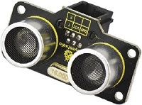

The ultrasonic module will emit the ultrasonic waves after trigger signal. When the ultrasonic waves encounter the object and are reflected back, the module outputs an echo signal, so it can determine the distance of object from the time difference between trigger signal and echo signal.

**Use method and timing chart of ultrasonic module:**

1. Setting the delay time of Trig pin of SR04 to 10μs at least, which can trigger it to detect distance.

2. After triggering, the module will automatically send eight 40KHz ultrasonic pulses and detect whether there is a signal return. This step will be completed automatically by the module.

3. If the signal returns, the Echo pin will output a high level, and the duration of the high level is the time from the transmission of the ultrasonic wave to the return.

4. the distance measured by ultrasonic wave = (speed \* time) / 2  .

#### 3. Specification: 

- Power Supply :+5V DC

- Quiescent Current : \<2mA

- Working Current: 15mA

- Effectual Angle: \<15°

- Ranging Distance : 2cm – 400 cm

- Resolution : 0.3 cm

- Measuring Angle: 30 degree

- Trigger Input Pulse width: 10uS

- Output echo signal: output TTL level(high), proportional to distance

- Interface：dual digital I/O port

#### 4. Wiring Up: 

Insert micro:bit onto EASY Plug shield, connect an ultrasonic sensor to P1-P2 of shield.

Note: Dial Voltmeter_Switch to 5V end.

#### 5. Test Code: 

You could navigate [https://makecode.micro:bit.org/reference](https://makecode.microbit.org/reference) to have access to more details.

Browse link [https://makecode.micro:bit.org/](https://makecode.microbit.org/) to edit your program. The following test code is as for your reference.

**Code 1：**

|  | “on start”:  command block only runs once to start program. Turn off  dot matrix on micro:bit  The program under “forever” runs cyclically. Set P1 to low level(0) Delay in 2ms Set P1 to high level(1) Delay in 10ms Set P1 to low level(0) Serial writes distance(cm)=distance Delay in 50ms |
| ----------------------------------------------- | ------------------------------------------------------------ |

**Code 2：**

Next to add the library of ultrasonic sensor, click “Extensions”

Search “sonar”，and click sonar library to download it.

After the installation, you will view it appear in the listed blocks on Makecode editor.

**Complete Code：**

|  |      |
| ----------------------------------------------- | ---- |

#### 6. Test Results: 

Wiring up, dial Voltmeter_Switch to 3V end, plug in external power and dial Power_Switch to ON end and upload code 1 and 2 to micro:bit.

Open CoolTerm, click Options and select SerialPort, set COM port and baud rate, set baud rate to 115200. Tap OK and Connect.

Micro:bit and CoolTerm monitor will display the current temperature, as shown below:

CoolTerm monitor will display the distance value.

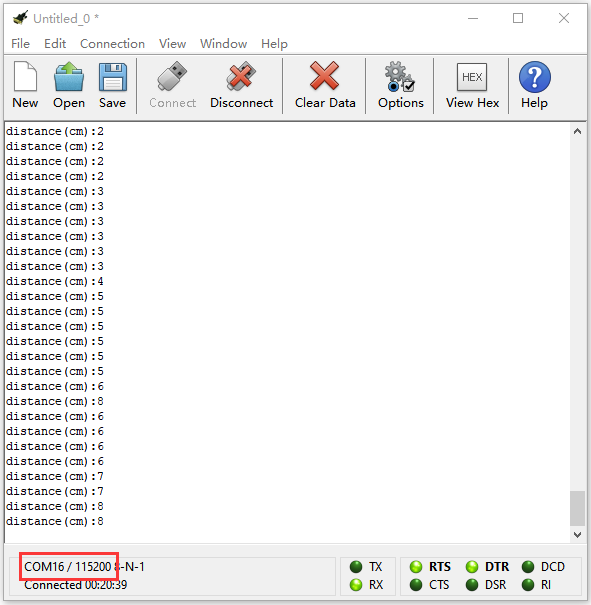

### Project 32: IR Remote Control Decoding

#### 1. Description: 

Every mad scientist’s lab, or teenager’s secret room, needs advanced protection against intrusion by rogue agents or siblings. If you are one of them, you should probably consider getting a Passive infrared (PIR) sensor for you. PIR sensors allow you to detect when someone is in your room when they shouldn’t be.

#### 2. What You Need: 

-   Micro:bit Board\*1

-   EASY Plug Shield for micro bit V1.1\*1

-   Micro USB Cable\*1

-   EASY Plug IR Receiver Module\*1

-   EASY Plug IR Remote Control\*1

-   RJ11 Cable\*1

-   6-Slot AA Battery Holder\*1

-   1.5V AA Battery\*6

#### 3. EASY Plug IR Receiver Module: 

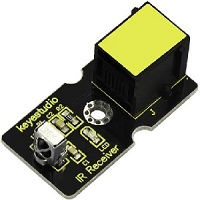

There is no doubt that infrared remote control is ubiquitous in daily life. It is used to control various household appliances, such as TVs, stereos, video recorders and satellite signal receivers. Infrared remote control is composed of infrared transmitting and infrared receiving systems, that is, an infrared remote control and infrared receiving module and a single-chip microcomputer capable of decoding.​

The 38K infrared carrier signal emitted by remote controller is encoded by the encoding chip in the remote controller. It is composed of a section of pilot code, user code, user inverse code, data code, and data inverse code. The time interval of the pulse is used to distinguish whether it is a 0 or 1 signal and the encoding is made up of these 0, 1 signals. 

The user code of the same remote control is unchanged. The data code can distinguish the key.

When the remote control button is pressed, the remote control sends out an infrared carrier signal. When the IR receiver receives the signal, the program will decode the carrier signal and determines which key is pressed. The MCU decodes the received 01 signal, thereby judging what key is pressed by the remote control.

Infrared receiver we use is an infrared receiver module. Mainly composed of an infrared receiver head, it is a device that integrates reception, amplification, and demodulation. Its internal IC has completed demodulation, and can achieve from infrared reception to output and be compatible with TTL signals. Additionally, it is suitable for infrared remote control and infrared data transmission. The infrared receiving module made by the receiver has only three pins, signal line, VCC and GND. It is very convenient to communicate with arduino and other microcontrollers.

**Specification：**

- Interface: Easy plug

- Working voltage: 5V Interface

- Type: DigitaL

- Modulation frequency: 38Khz

#### 4. Wiring Up: 

Insert micro:bit onto EASY Plug shield, connect an IR receiver module toP12 port of shield.

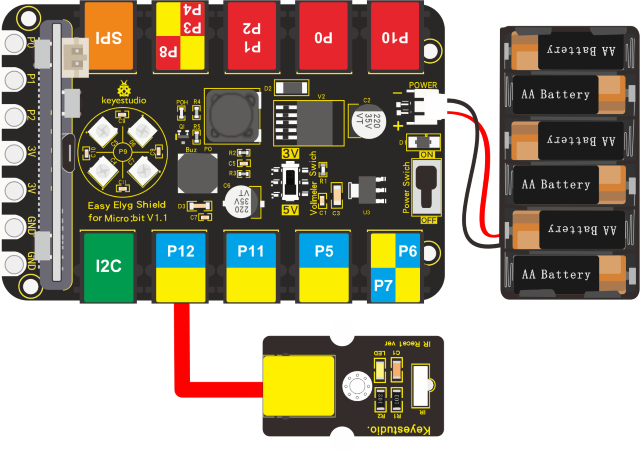

Note: Dial Voltmeter_Switch to 5V.

#### 5. Test Code: 

You could navigate [https://makecode.micro:bit.org/reference](https://makecode.microbit.org/reference) to have access to more details.

Browse link [https://makecode.micro:bit.org/](https://makecode.microbit.org/) to edit your program. The following test code is as for your reference.

Next, we need to add the library of IR receiver module.

Click “Extensions” on Makecode editor.

Enter the library link: Copy [https://github.com/keyestudio-team/pxt-RI-receiver.git](https://github.com/keyestudio-team/pxt-RI-receiver.git) and search, and download “keyestudio-IR-remote” file.

After the installation, you will see the “IR remote” in the listed blocks.

**Complete Code：**

|  | “on start”: command block only runs once to start program. Turn off LED matrix Connect IR receiver to P12  The program under “forever” runs cyclically. Set val to IR button Serial writes IR=val Delay in 1000ms |
| ----------------------------------------------- | ------------------------------------------------------------ |

Code explanation: serial monitor will refresh and show 0, when the key is not pressed; when it is pressed, CoolTerm will show the corresponding value.
 
 
**Note：**

1. Battery is not included, you need to make a purchase it (model: CR2025).

2. Make sure IR remote control is good, open camera on your cellphone, point IR remote control to camera and press button. It is good if you see purple light flashing.

#### 6. Test Results： 

Wiring up, dial Voltmeter_Switch to 5V end, plug in external power and dial Power_Switch to ON end and upload code to micro:bit.

Open CoolTerm, click Options and select SerialPort, set COM port and baud rate, set baud rate to 115200. Tap OK and Connect.

CoolTerm monitor will display the corresponding key values, as shown below:

Below we have listed out each button value of keyestudio remote control. So you can keep it for reference.

### Project 33: IR Remote Control RGB

#### 1. Description: 

We decode the IR remote control with an IR receiver module and a micro:bit board before doing experiment. We could get key values which can control the external sensors/ modules after decoding IR remote control. In this experiment, we control 2812 2x2 full color RGB of shield with these key values.

#### 2. What You Need: 

-   Micro:bit Board\*1

-   EASY Plug Shield for micro bit V1.1\*1

-   Micro USB Cable\*1

-   EASY Plug IR Receiver\*1

-   EASY Plug IR Remote Control\*1

-   RJ11 Cable\*1

-   6-Slot AA Battery Holder\*1

-   1.5V AA Battery\*6

#### 3. Wiring Up: 

Insert micro:bit onto EASY Plug shield, connect IR receiver to P12 port to shield with a RJ11 cable.

Note: Dial Voltmeter_Switch to 5V end.

#### 4. Test Code: 

You could navigate [https://makecode.micro:bit.org/reference](https://makecode.microbit.org/reference) to have access to more details.

Browse link [https://makecode.micro:bit.org/](https://makecode.microbit.org/) to edit your program. The following test code is as for your reference.

Next, we need to add the library file of IR receiver module.

Click “Extensions” on Makecode.

Enter the library link [https://github.com/keyestudio-team/pxt-RI-receiver.git](https://github.com/keyestudio-team/pxt-RI-receiver.git) and search, as shown below，download the file.

Then you could view the library of IR receiver module in the listed blocks.

Repeat the above steps to add the library of “neopixel”:

Click “Extensions” → “neopixel”, after second, install the library of “neopixel”.

**Complete Code：**

|   | “on start”:  command block only runs once to start program.  Turn off dot matrix on micro:bit Connect IR receiver to P12 Set strip to Neopixel at pin p9 with 4 leds as RGB Turn off 4pcs WS2812 RGB lights Set val to 0 Set val2 to 0   The program under the block“forever”runs cyclically.  Set val to IR button  When val≠0, execute the program under then block  Set val2 to val When val2=70, execute the program under then block All RGB display red color When val2=68, execute the program under then block All RGB show orange color When val2=67, execute the program under then block All RGB display yellow color When val2=64, execute the program under then block All RGB display green color When val2=21, execute the program under then block All RGB display blue color When val2=22, execute the program under then block All RGB display indigo color When val2=25, execute the program under then block All RGB display violet color When val2=13, execute the program under then block All RGB display purple color When val2=12, execute the program under then block All RGB display white color |
| ------------------------------------------------------------ | ------------------------------------------------------------ |

#### 5. Test Results: 

Wire up, plug in power, dial Voltmeter_Switch to 5V end and upload code to micro:bit.

Point IR remote control to IR receiver and press keys.

|                       Key                       | Status | 2812 2x2 full-color RGB |
| :---------------------------------------------: | :----: | ----------------------- |
|  | Press  | Red Color               |
|  | Press  | Orange Color            |
|  | Press  | Yellow Color            |
|  | Press  | Green Color             |
|  | Press  | Blue Color              |
|  | Press  | Indigo Color            |
|  | Press  | Violet Color            |
|  | Press  | Purple Color            |
|  | Press  | White Color             |

### Project 34: Joystick

#### 1. Description: 

Lots of robot projects need joystick. This module provides an affordable solution.   

By simply connecting to two analog inputs, the robot is at your commands with X, Y control. It also has a switch that is connected to a digital pin.

#### 2. What You Need: 

-   Micro:bit Board\*1

-   EASY Plug Shield for micro bit V1.1\*1

-   Micro USB Cable\*1

-   EASY Plug Joystick Module\*1

-   RJ11 Cable\*1

-   6-Slot AA Battery Holder\*1

-   1.5V AA Battery\*6

#### 3. EASY Plug Joystick Module: 

This is a joystick very similar to the‘analog’ joysticks on PS2 (PlayStation 2) controllers. It is a self-centering spring loaded joystick, meaning when you release the joystick it will center itself. It also contains a comfortable cup-type knob/cap which gives the feel of a thumb-stick.

The goal of the joystick is to communicate motion in 3D (3-axis) to an Arduino. This is achieved by housing two independent 10K potentiometers (one per axis). These potentiometers are used as dual adjustable voltage dividers, providing x and y axis analog input in a control stick form.

This joystick also contains a switch which activates when you push down on the cap. The switch is the small black box on the rear of the joystick.

The basic idea of a joystick is to translate the stick’s position on three axes — the X-axis (left to right), the Y-axis(front and back) into electronic information an Arduino can process and the Z-axis(up and down).

**Specification：**

-   Interface: Easy plug

-   Working voltage: 3.3V to 5V

-   Interface type: analog port and digital port

#### 4. Wiring Up: 

Insert micro:bit onto EASY Plug shield and connect joystick module to P3-P4-P8 port of shield with a RJ11 cable.

Note: Dial Voltmeter_Switch to 3V end.

#### 5. Test Code: 

You could navigate [https://makecode.micro:bit.org/reference](https://makecode.microbit.org/reference) to have access to more details.

Browse link [https://makecode.micro:bit.org/](https://makecode.microbit.org/) to edit your program. The following test code is as for your reference.

|  | “on start”:  command block only runs once to start program. Turn off dot matrix on micro:bit  The program under “forever” runs cyclically.  Set variable X to digital signals on X axis  Set variable Y to digital signals on Y axis Set variable B to digital signals on Z axis  Serial writes value X=P3 to read the analog signals on X axis Serial writes value Y=P4 to read the analog signals on Y axis Serial writes value B=P8 to read the digital signals on Z axis   Delay in 100ms |
| ----------------------------------------------- | ------------------------------------------------------------ |

#### 6. Test Results: 

Wiring up, dial Voltmeter_Switch to 3V end, plug in external power and dial Power_Switch to ON end and upload code to micro:bit.

Open CoolTerm, click Options and select SerialPort, set COM port and baud rate, set baud rate to 115200. Tap OK and Connect.

CoolTerm monitor shows the analog value on x, y axis and pin B.

### Project 35: What Time Is It?

#### 1. Description: 

In this program, we will demonstrate how to read time by combing DS3231 clock module with micro:bit. You will view the time on CoolTerm monitor.

#### 2. What You Need: 

- Micro:bit Board\*1

- EASY Plug Shield for micro bit V1.1\*1

- Micro USB Cable\*1

- EASY Plug DS3231 Clock Module\*1

- RJ11 Cable\*1

- 6-Slot AA Battery Holder\*1

- 1.5V AA Battery\*6

#### 3. EASY Plug DS3231 Clock Module: 

The DS3231 is a low-cost, extremely accurate I2C real-time clock (RTC) with an integrated temperature-compensated crystal oscillator (TCXO) and crystal.  A real-time clock (RTC) is a computer clock (most often in the form of an integrated circuit) that keeps track of the current time.

At the heart of the module is a low-cost, extremely accurate RTC chip from Maxim – **DS3231**. It manages all timekeeping functions and features a simple two-wire I2C interface which can be easily interfaced with any microcontroller of your choice.  

The chip maintains seconds, minutes, hours, day, date, month, and year information. The date at the end of the month is automatically adjusted for months with fewer than 31 days, including corrections for leap year (valid up to 2100).     

The clock operates in either the 24-hour or 12-hour format with an AM/PM indicator. It also provides two programmable time-of-day alarms and one programmable square wave output.

The DS3231 incorporates a battery input, and maintains accurate timekeeping when main power to the device is interrupted.

The built-in power-sense circuit continuously monitors the status of VCC to detect power failures and automatically switches to the backup supply. So, you need not worry about power outages, your MCU can still keep track of time.

EASY Plug DS3231 module integrates pin GND, VCC, SDA and SCL for easily wiring up and can communicate with MCUs in synchronic and serial way.

**SCL** is a serial clock pin for I2C interface.

**SDA** is a serial data pin for I2C interface.

**VCC** pin supplies power for the module.

**GND** is a ground pin.

**Specification：**

- Temperature range: -40℃ to +85℃

- Timing accuracy: about ± 5ppm

- Output: 1Hz and 32.768kHz

- High speed (400kHz), I2C serial bus

- Supply voltage: 3.3V to 5.5V

- Output Level: TTL level

#### 4. Wiring Up:

Insert micro:bit onto EASY Plug shield, connect DS3231 clock module to I2C port of shield with a RJ11 cable.

Note: Dial Voltmeter_Switch to 5V end.

#### 5. Test Code: 

You could navigate [https://makecode.micro:bit.org/reference](https://makecode.microbit.org/reference) to have access to more details.

Browse link: [https://makecode.micro:bit.org/](https://makecode.microbit.org/) to edit your program. The following test code is as for your reference.

Need to set test code, therefore, let’s add the library of DS3231 clock module.

Set code with library file, click “Extensions”.

Enter library link: [https://github.com/keyestudio-team/pxt-DS3231](https://github.com/keyestudio-team/pxt-DS3231) and search it, download it as follows:

After the installation, you could see it in the listed blocks on Makecode editor.

**Complete Code：**

#### 6. Test Results: 

Wiring up, dial Voltmeter_Switch to 5V end, plug in external power and dial Power_Switch to ON end and upload code to micro:bit.

Open CoolTerm, click Options and select SerialPort, set COM port and baud rate, set baud rate to 115200. Tap OK and Connect.

CoolTerm monitor will display time(year/month/day/week/hour/minute/second), as shown below:

